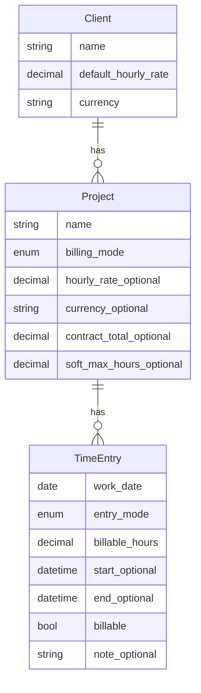

# M1 — Billing Ledger (Core)

## Summary

Deliver the core billing ledger in `ttd.core`: clients with default rate and currency, projects under clients with per-project billing mode (hourly or fixed-price), and flexible time entries where billable hours are canonical. Hourly projects use inheritable rates; fixed-price projects store a contract total and use entries to track effort. Core CRUD services and tests only — no CLI, export, or product surfaces.

---

## Problem Frame

M0 established the repo foundation, but there is no ledger data model yet — only a SQLite connect stub. The product strategy centers on a billing-native client → project → entry hierarchy with retroactive capture (duration or interval, equal standing) and one source of truth for later exports. Solo developers billing hourly need that model in core before terminal capture (M2) or period close (M3) can ship. Fixed-price contracts also appear in real work: the developer tracks hours against a lump-sum project and derives an implied hourly rate for future estimation, without multiplying entries by an hourly rate.

---

## Actors

- A1. **Solo developer (ledger owner):** Creates clients and projects, logs and corrects time entries, relies on core services (and later surfaces) for trustworthy totals.
- A2. **Downstream implementer (M2+ surfaces):** Calls core services for CRUD and read models; must not reimplement domain rules in CLI, TUI, or API.

---

## Key Flows

- F1. **Set up hourly billing for a client**
  - **Trigger:** Developer adds a new contracted customer billed by the hour.
  - **Actors:** A1
  - **Steps:** Create client with name, default hourly rate, and ISO currency → create hourly project under client (inherit rate/currency or override on project) → optionally set soft-max hours on project.
  - **Outcome:** Project is ready to receive time entries; effective rate resolves from project override or client default.
  - **Covered by:** R1, R2, R3, R4, R5

- F2. **Set up fixed-price project tracking**
  - **Trigger:** Developer has a lump-sum contract for a deliverable and wants to track effort, not bill line items by the hour.
  - **Actors:** A1
  - **Steps:** Create or select client → create fixed-price project with contract total and currency → log entries as hours-only or interval → core aggregates logged hours; implied hourly rate is derivable when needed.
  - **Outcome:** Hours accrue against the project without rate × hours billing math; contract total remains the commercial anchor.
  - **Covered by:** R3, R4, R6, R7, R8, R9

- F3. **Log retroactive work (core service path)**
  - **Trigger:** Developer records work after the fact via core API (tests or future CLI).
  - **Actors:** A1, A2
  - **Steps:** Select project → supply explicit work date → either billable hours (duration mode) or time-in/out (interval mode) → optional note and billable flag → persist entry → for interval mode, snapshot derived hours at write.
  - **Outcome:** Entry is stored; billable hours are available for totals; interval timestamps retained for audit.
  - **Covered by:** R8, R9, R10, R11

---

## Requirements

**Entity hierarchy**

- R1. A **Client** represents a contracted customer. Required: human-readable name, default billable hourly rate, ISO 4217 currency code. A client owns one or more projects.
- R2. Client default rate and currency apply to **hourly** child projects unless the project overrides them.
- R3. A **Project** belongs to exactly one client. Required: name (unique within the client). Required: **billing mode** — `hourly` or `fixed_price`.
- R4. **Hourly project:** May override hourly rate and currency together; if not overridden, inherits from client. May set an optional **soft-max hours** threshold (nullable). Logging beyond soft-max is always allowed; threshold exists for future notification only (not enforced in M1).
- R5. **Fixed-price project:** Required contract total and ISO currency. No hourly rate fields on the project. May set optional soft-max hours for effort guardrails (same non-blocking semantics as hourly).
- R6. Stable internal identifiers exist for clients, projects, and entries (surfaces and exports reference ids, not names alone).

**Time entries**

- R7. A **Time entry** belongs to exactly one project. Multiple entries per calendar day per project are allowed.
- R8. Every entry has an explicit **work date** (required) used for billing-period rollups and reporting — independent of interval timestamps.
- R9. Every entry supports an optional note and a **billable** yes/no flag. Non-billable entries are stored; billable-hour aggregates exclude non-billable entries.
- R10. Entry capture supports two modes with equal standing at input time:
  - **Duration mode:** User supplies billable hours (canonical stored value) and work date; no synthetic time-in/time-out is generated.
  - **Interval mode:** User supplies time-in and time-out (timezone-aware); system persists start, end, work date, and **snapshots derived billable hours at write time**. On edit of start/end, derived hours are recomputed.
- R11. For all billing and aggregation paths, **billable hours on the entry are canonical** — interval timestamps support audit and recomputation, not a competing billing truth.
- R12. Duration and interval entries are not required to convert to the other mode before persistence or before future export (aligned with `STRATEGY.md` — no “convert before bill” for duration).

**Core services (M1)**

- R13. Core provides async CRUD services for clients, projects, and time entries with validation at the service layer (raises on invalid input; surfaces catch later in M2+).
- R14. Services resolve **effective hourly rate** for hourly projects (project override else client default). Fixed-price projects do not use rate × hours for billing totals.
- R15. Core provides a read-side helper to compute **implied hourly rate** for a fixed-price project: contract total ÷ sum of billable hours on that project (define behavior when hours sum to zero — see AE3). No CLI/TUI display required in M1.
- R16. Core may expose project **hours vs soft-max** status for future adapters (e.g., over threshold); M1 does not emit user-facing notifications.
- R17. All domain logic for the above lives in `ttd.core` only — no duplicate rules in `ttd.cli`, `ttd.api`, or `ttd.tui`.

**Persistence & quality**

- R18. Ledger entities are persisted in SQLite via ferro-orm models in core; migration/revision workflow is defined during planning (`docs/design/data-layer.md` to be added).
- R19. Service-layer tests cover happy paths: client/project CRUD, hourly rate inheritance, fixed-price vs hourly validation, duration and interval entry create/update, billable flag exclusion from hour totals.
- R20. First Hypothesis property tests cover duration/interval hour derivation invariants (e.g., interval snapshot matches deterministic formula; edits recompute consistently).

---

## Acceptance Examples

- AE1. **Covers R2, R4, R14.** Given a client with default rate $150 USD and an hourly project with no override, when effective rate is resolved, then the rate is $150 USD.
- AE2. **Covers R4, R14.** Given a client with default rate $150 USD and an hourly project overriding rate to $175 CAD, when effective rate is resolved, then the rate is $175 CAD (currency override travels with rate override).
- AE3. **Covers R6, R15.** Given a fixed-price project with contract total $10,000 USD and billable entries totaling 40 hours, when implied hourly rate is requested, then the result is $250 USD per hour. Given zero billable hours, when implied hourly rate is requested, then the operation returns a defined empty/undefined outcome (not a divide-by-zero crash) — exact representation deferred to planning.
- AE4. **Covers R9, R11.** Given two entries on the same project and work date — one billable 3h, one non-billable 2h — when billable hours are summed for the project, then the total is 3h.
- AE5. **Covers R10, R11.** Given an interval entry from 09:00 to 12:30 on a work date, when persisted, then stored snapshotted hours equal 3.5 and start/end timestamps are retrievable; when end is edited to 13:00, then snapshotted hours update to 4.0.
- AE6. **Covers R4, R16.** Given a project with soft-max 100h and 105h already logged, when a new entry is added via core services, then the entry persists successfully (no hard block); hours-over-threshold status is available for a future surface to consume.
- AE7. **Covers R5, R14.** Given a fixed-price project, when billing totals are computed for export-readiness in core, then totals are hour-based (and contract total is available separately), not rate × hours.

---

## Success Criteria

- A developer can create clients, hourly and fixed-price projects, and mixed entry modes entirely through core services and tests — without a spreadsheet-shaped workaround.
- Hourly and fixed-price projects coexist under one client without schema migration pain when M2 CLI arrives.
- Planning (`ce-plan`) does not need to invent billing mode semantics, hour canonicalization, or fixed-price contract fields.
- Property tests give confidence that interval snapshots and duration entries won’t diverge silently before M3 export.

---

## Scope Boundaries

- CLI commands (`ttd client`, `ttd project`, `ttd log`, `ttd entries`) — M2
- CSV export, global rounding, billing period close — M3
- Soft-max **notifications** in CLI/TUI/API — M2+ (threshold field may exist in M1)
- Implied-rate dashboards, estimation UX, “compare to similar projects” analytics
- PDF/Markdown invoices, TUI screens, Litestar product routes — M5–M7
- Timer-first capture, tags, Raycast/MCP, cloud sync, team features
- Multi-currency conversion or FX between clients
- Mimicking the founder’s legacy spreadsheet layout column-for-column
- Forcing users to convert duration entries to interval (or vice versa) as a workflow step
- Tags, utilization metrics, payroll, full accounting / payments

---

## Key Decisions

- **Approach A — hours-canonical, single entry type:** Billable hours are the billing unit; duration mode stores hours directly; interval mode stores timestamps plus snapshotted hours at write. Rejected time-canonical model (synthetic clock times for hours-only entries) and split entry tables (unnecessary carrying cost for M1).
- **Per-project billing mode:** Each project is hourly or fixed-price; a client may have both types concurrently.
- **Fixed-price commercial anchor:** Contract total + currency on the project; entries track effort in hours; implied hourly rate is derived, not stored as the billable rate.
- **Explicit work date on every entry:** Period rollups use work date, not inferred-only dating from interval start.
- **Interval snapshot at write:** Persist start/end and snapshotted hours; recompute hours on edit of interval bounds.
- **ISO currency per entity:** Client default currency; hourly projects may override rate and currency together; fixed-price projects use contract currency without hourly rate fields.
- **Soft-max is informational:** Stored threshold, never blocks logging in M1; notifications deferred.
- **M1 is core-only:** Models, migrations policy, services, tests — no product surface commands.

---

## Dependencies / Assumptions

- M0 foundation is complete (`brainstorms/2026-05-24-foundational-techstack-requirements.md`, `plans/2026-05-24-001-feat-foundational-techstack-plan.md`).
- `STRATEGY.md` hourly T&M positioning remains primary; fixed-price is an extension captured here for schema correctness, not a strategy rewrite in M1.
- ferro-orm + SQLite remain the persistence stack; Alembic vs `auto_migrate` policy is decided in planning alongside `docs/design/data-layer.md`.
- Delete/archive behavior for clients, projects, and entries was not finalized in brainstorm — planner selects a safe default (see Outstanding Questions).
- Roadmap M1 ship criteria (`docs/roadmap.md`) are satisfied when this doc’s requirements are implemented in core with tests.

---

## Outstanding Questions

### Deferred to Planning

- [Affects R6, R13][Technical] Delete and archive policy: hard-delete entries only vs soft-archive parents; cascade rules when deleting clients with projects.
- [Affects R18][Technical] Alembic revision workflow vs dev `auto_migrate` once schema is defined.
- [Affects R10][Technical] Timezone storage and validation rules for interval bounds (same calendar day vs overnight span).
- [Affects R15][Technical] Exact return type when implied hourly rate is undefined (zero hours).
- [Affects R1][Technical] Additional client metadata (contact email, address, external ids) — defer unless needed for M2 CLI.

### Resolve Before Planning

_None — user confirmed synthesis 2026-05-24._

---

## Reference — entity relationships

