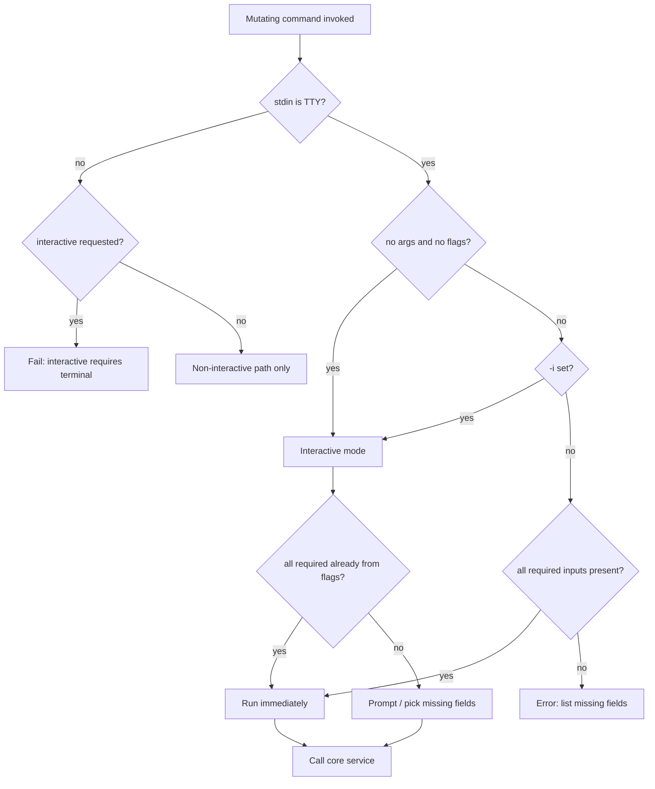

# CLI Interactive Capture

## Summary

Extend the `ttd` CLI so mutating commands (`add`, `update`, `delete`, and `log`) support guided, terminal-friendly input: **no arguments defaults to interactive mode**, **`-i` enables interactive fill-in when some flags are already set**, and **fields that reference existing ledger data use pick-from-list UX** while new values stay free-form. Scriptable flag-only invocations remain unchanged when all required inputs are supplied without `-i`. CLI pickers use lightweight inline terminal UI—not the Textual app (`ttd-tui`).

---

## Problem Frame

M2 shipped flag-only CLI commands. Solo developers capturing time retroactively often run a command from muscle memory without remembering every flag name, rate format, or UUID. Today, `ttd client add` with no args fails at parse time; `ttd client delete` expects a raw UUID. That friction works against `STRATEGY.md`’s **terminal-first capture** track and the **median time to log a retroactive entry** metric—every extra lookup (client id, flag spelling) adds seconds and encourages deferring capture until period close.

---

## Actors

- A1. **Solo developer (CLI user):** Runs mutating `ttd` commands interactively during work or non-interactively in scripts.
- A2. **Downstream implementer (TUI/API):** Reuses shared field/collection semantics where practical; does not duplicate domain rules.

---

## Key Flows

- F1. **Add a client with no flags**
  - **Trigger:** User runs `ttd client add` with no positional args and no flags.
  - **Actors:** A1
  - **Steps:** CLI enters interactive mode → prompts for name, default rate, currency (free text / validated text) → calls core `create_client` → prints success.
  - **Outcome:** Client exists; user never needed `--name` / `--rate` on the command line.
  - **Covered by:** R1, R2, R4, R5, R10

- F2. **Add a project under an existing client**
  - **Trigger:** User runs `ttd project add` (no args) or `ttd project add -i` with partial flags.
  - **Actors:** A1
  - **Steps:** Interactive mode → **pick client** from live list → prompt for project name, billing mode (constrained choice), conditional fields per mode → create via core.
  - **Outcome:** Project created under chosen client.
  - **Covered by:** R3, R4, R5, R6, R10

- F3. **Delete a client interactively**
  - **Trigger:** User runs `ttd client delete` with no args (or `-i` with incomplete targeting).
  - **Actors:** A1
  - **Steps:** Pick client from list (display name + short id) → **confirm** destructive action → delete via core → success message.
  - **Outcome:** Client removed per core rules (e.g. only when no projects); user never pasted a UUID.
  - **Covered by:** R3, R7, R8, R10

- F4. **Log time interactively**
  - **Trigger:** User runs `ttd log` with no args.
  - **Actors:** A1
  - **Steps:** Pick client → pick project (filtered to client) → work date (default today) → choose duration vs interval path → collect hours or from/to → optional note and billable flag → create entry via core.
  - **Outcome:** Entry persisted; same validation as flag-based `log`.
  - **Covered by:** R3, R4, R6, R9, R10

- F5. **Scripted add with explicit flags**
  - **Trigger:** User runs `ttd client add --name Acme --rate 150 --currency USD` (all required fields present, no `-i`).
  - **Actors:** A1
  - **Steps:** No prompts; command parses and executes immediately.
  - **Outcome:** Same as today’s non-interactive path; CI and scripts unaffected.
  - **Covered by:** R1, R2, R11

---

## Requirements

**Interactive mode triggers**

- R1. A global **`-i` / `--interactive`** flag is available on mutating CLI commands covered by this feature. When set, the command runs in interactive mode.
- R2. When a mutating command is invoked with **no arguments and no flags** (empty argv for that command), it runs in **interactive mode**—equivalent to passing `-i` alone.
- R3. When interactive mode is active and the user supplies **some** flags but not all required inputs, the CLI **prompts only for missing** fields; provided flag values are respected.
- R4. When the user supplies **some** flags but **not** `-i` and the invocation is **incomplete** for non-interactive execution, the CLI **fails** with a clear error listing **missing required** fields (no silent fallback to interactive).
- R5. When interactive mode is requested and **stdin is not a TTY**, the CLI **fails fast** with a clear error (no prompts, no hang).
- R6. When interactive mode is active but **all required inputs are already satisfied** (via flags), the command runs **without redundant prompts**.

**Field behavior**

- R7. **Create-new fields** (e.g. client name on `client add`, project name on `project add`) use **free-form text** prompts with the same validation as the existing flag path (`parse_decimal`, currency codes, etc.).
- R8. **Reference-existing fields** (e.g. client on `project add`, client on `client delete`, project on `log`, entry on `entries delete`) use **select-from-list** UX backed by **live data** from core services (not hardcoded samples).
- R9. List selections show a **human-readable label** (at minimum name; may include short id or secondary hint). The CLI resolves the selection to the correct internal identifier (UUID) before calling core.
- R10. **Enum-like fields** (e.g. billing mode, duration vs interval branch on `log`) use a **constrained choice** prompt, not unconstrained text.
- R11. When a reference list is **empty** (e.g. no clients yet for `project add`), interactive mode **fails** with an actionable message (e.g. create a client first)—not an empty picker.
- R12. **Dependent pickers** respect hierarchy: project choices on `log` are limited to projects under the selected client.

**Command coverage**

- R13. **Client commands:** `add`, `update`, `delete` support interactive mode per R1–R6.
- R14. **Project commands:** `add`, `update`, `delete` support interactive mode per R1–R6.
- R15. **Time entry commands:** `log` (default command) and `entries` **update** / **delete** support interactive mode per R1–R6.
- R16. Non-mutating commands (`list`, etc.) are **unchanged**—no interactive default on empty invocation unless explicitly specified elsewhere.

**Safety and UX**

- R17. **Destructive** interactive commands (`delete` on client, project, entry) require an explicit **confirmation** step after the target is selected.
- R18. **Cancel** (e.g. Ctrl+C during prompts) exits with a **non-zero** status and a brief message; no partial persistence.
- R19. Validation errors from core or CLI parsing during interactive collection surface the **same user-facing messages** as the flag path (via existing `cli_exit` / error adapters).
- R20. Command **help text** documents interactive default (no args), `-i`, and the pick-vs-text behavior at a high level.

**Architecture**

- R21. Interactive collection and picker UX live in the **CLI adapter** (`ttd.cli`); **no new domain rules** in interactive code—all business validation remains in `ttd.core` services.
- R22. CLI interactive pickers use **inline terminal selection** (arrow-key list or equivalent)—**not** launching the Textual `ttd-tui` application.
- R23. Field definitions (what to ask, pick vs text, labels, ordering) are structured so **TUI (M5)** can reuse the same semantics with Textual widgets later without duplicating “what fields does `project add` need?”

---

## Acceptance Examples

- AE1. **Covers R2, R7, R10.** Given an empty database, when the user runs `ttd client add` with no args, then the CLI prompts for name, rate, and currency and creates the client on valid answers.
- AE2. **Covers R4.** Given the user runs `ttd client add --name Acme` without `-i`, then the CLI errors and lists missing required fields (e.g. rate)—it does not start prompts.
- AE3. **Covers R3, R8.** Given clients Acme and Beta exist, when the user runs `ttd project add --client Acme -i` and supplies only the remaining prompts, then the project is created under Acme without re-picking the client.
- AE4. **Covers R8, R11.** Given no clients exist, when the user runs `ttd project add` with no args, then the CLI errors with guidance to create a client first—not an empty selection UI.
- AE5. **Covers R5.** Given stdin is not a TTY, when the user runs `ttd client add -i`, then the CLI exits non-zero with a message that interactive mode requires a terminal.
- AE6. **Covers R8, R12, R9.** Given client Acme with projects Website and API, when the user runs `ttd log` interactively and selects Acme, then the project picker offers only Website and API.
- AE7. **Covers R17.** Given client Acme exists, when the user runs `ttd client delete` interactively and selects Acme but declines confirmation, then no delete occurs and the CLI exits without success messaging for deletion.
- AE8. **Covers R6, R11.** Given the user runs `ttd client add --name Acme --rate 150 --currency USD` without `-i`, then no prompts run and the client is created immediately.
- AE9. **Covers R10, R21.** Given the user runs `ttd log` interactively and chooses duration mode, when they enter hours and date, then a duration entry is created with the same rules as `ttd log --hours …` (interval flags not accepted in the same entry).

---

## Success Criteria

- A solo developer can run `ttd client add`, `ttd project add`, and `ttd log` with **no flags** and complete the flow without reading `--help` for required flag names.
- Referencing existing entities never requires copying UUIDs from `list` output in interactive mode.
- Existing scripted invocations with full flag sets behave as before (no prompt regression in CI).
- Planning (`ce-plan`) does not need to invent interactive triggers, picker vs text rules, or command coverage.

---

## Scope Boundaries

- Full-screen **Textual** app flows (`ttd-tui`, M5)—separate milestone; may share field metadata only
- **stdin-driven** non-TTY prompt scripting (read answers from piped input)
- **List/read-only** commands gaining interactive defaults on empty invocation
- Raycast, MCP, API, or agent-native tool surfaces
- New domain validation rules (rates, billing modes, delete guards stay in core)
- Auto-interactive when partial flags are passed **without** `-i` (explicit error only)
- Cloud sync, team features, timer-first UX

---

## Key Decisions

- **Explicit `-i` for hybrid partial-flag runs; no-args equals interactive:** Balances discoverability for bare commands with predictable scriptable behavior when any flags are present without `-i`.
- **Picker vs text by field semantics:** New values are typed; existing entities are chosen from DB-backed lists with human labels.
- **Inline terminal pickers, not Textual, for CLI:** Keeps one-shot commands fast and testable; Textual remains the M5 surface.
- **All mutators in v1:** `add`, `update`, `delete`, and `log`/`entries` paths that take user input—not only create commands.
- **Confirm on destructive interactive deletes:** Reduces accidental data loss.
- **Shared field specs for future TUI:** Collect/prompt definitions live at the adapter boundary, not duplicated per surface in core.

---

## Dependencies / Assumptions

- M1 core ledger and M2 CLI flag paths exist (`brainstorms/2026-05-24-billing-ledger-requirements.md`, M2 CLI in `docs/roadmap.md`).
- `STRATEGY.md` terminal-first capture remains the product anchor; this feature directly supports that track (may land as M2 enhancement or adjacent to M3—roadmap update deferred to planning).
- Current delete/update commands use UUID parameters; interactive mode will change **UX** (pick by label) while still calling the same core services with resolved ids.
- A suitable inline prompt/select library will be chosen in planning (Rich-only menus vs a small select dependency)—not a product decision in this doc.

---

## Outstanding Questions

### Resolve Before Planning

_None — user confirmed synthesis 2026-05-26._

### Deferred to Planning

- [Affects R23][Technical] Module layout for shared field specs (`ttd.cli.collect` vs per-command modules) and what to extract for future TUI.
- [Affects R13–R15][Technical] `update` interactive UX: prompt all optional fields sequentially vs “pick which fields to change” menu.
- [Affects R8][Technical] Picker implementation choice and test strategy (mock TTY vs integration tests).
- [Affects R1][Technical] cyclopts integration pattern for global `-i`, empty-invocation interactive default, and optional parameters on handlers.
- [Affects R20][User-visible] Exact help text and error message wording.
- [Roadmap] Whether to document this under M2 terminal capture or a small follow-on milestone in `docs/roadmap.md`.

---

## Reference — interactive mode decision

