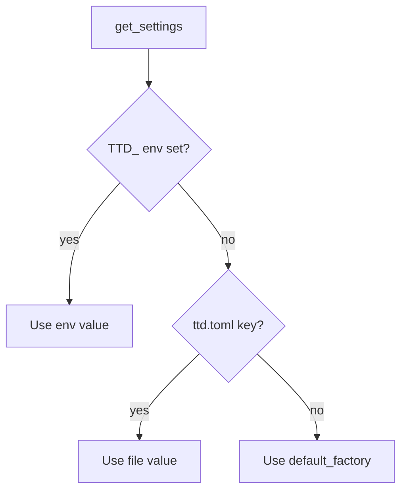

# User config, timezone, and flexible time input

## Summary

Add **`ttd config`** commands backed by a **`pydantic-settings`** `Settings` class that loads **`ttd.toml`** from a standard config directory (default `~/.config/ttd/ttd.toml`). First-run **`ttd config init`** captures data directory, IANA timezone (inferred default), and 12h/24h clock preference. Introduce **`pendulum`** in **`ttd.core`** for parsing flexible local date/time strings (e.g. `5pm`), converting to **UTC for persistence**, and formatting back to the user’s timezone and clock preference on display.

---

## Problem Frame

Today `Settings` only exposes `data_dir` and `db_filename` via env vars (`.env` optional). Interval capture labels times as **UTC** and parses **24-hour `HH:MM`** only—misaligned with how solo developers remember work. There is no guided first-run setup; `ttd db where` shows paths but does not establish preferences. Machine prefs should live outside the ledger DB so they exist before SQLite is created and survive `ttd db reset`.

---

## Actors

- A1. **Solo developer:** Runs `ttd config init` once, then logs and lists time in familiar local terms.
- A2. **Implementer:** Extends `Settings`, core time helpers, and CLI surfaces without duplicating conversion rules.

---

## Key Flows

- F1. **First-time setup**
  - **Trigger:** User runs `ttd config init` (or app suggests it when `ttd.toml` is missing).
  - **Steps:** Prompt for data directory (default XDG data path) → confirm/create parent dirs → infer timezone (editable) → choose 12h vs 24h → write `ttd.toml` → optional `ttd db migrate`.
  - **Outcome:** `get_settings()` returns file-backed prefs; subsequent commands use local-time UX.

- F2. **Log interval in local time**
  - **Trigger:** `ttd log` (flags or interactive) with interval mode.
  - **Steps:** User enters `5pm`–`6:30pm` on a work date → core parses in configured timezone → stores UTC `started_at`/`ended_at` + `work_date` → displays success in local format.
  - **Outcome:** DB remains UTC; user never types UTC.

- F3. **Inspect or tweak config**
  - **Trigger:** `ttd config show` / `get` / `set`.
  - **Steps:** Read or update `ttd.toml`; env vars still override for automation.
  - **Outcome:** No manual file editing required.

---

## Requirements

**Config file and settings model**

- R1. **`ttd.toml`** is the canonical config file. Default path: **`{XDG_CONFIG_HOME}/ttd/ttd.toml`** (typically `~/.config/ttd/ttd.toml`). Create parent directory on init/write if missing.
- R2. **`Settings`** (pydantic-settings) loads, at minimum: `data_dir`, `db_filename`, `timezone` (IANA string), `clock_format` (`12h` | `24h`). Existing `db_path` / `db_dsn` properties remain derived.
- R3. **Precedence (highest wins):** environment variables (`TTD_*`) → `ttd.toml` → built-in defaults. `.env` in cwd may remain as an optional extra source if already supported; document order in `docs/design/general.md` or data-layer doc.
- R4. **`get_settings()`** is cached or reload-safe per process; `config set` documents that long-running shells may need a new invocation to see changes (no daemon in v1).

**`ttd config` commands**

- R5. **`ttd config init`** — interactive wizard; writes `ttd.toml`; does not delete ledger data unless user separately runs `ttd db reset`.
- R6. **`ttd config show`** — print all settings (Rich table): effective values after precedence, and path to `ttd.toml`.
- R7. **`ttd config get <key>`** — print one effective value (scriptable).
- R8. **`ttd config set <key> <value>`** — update `ttd.toml` (validate via `Settings`); unknown keys error clearly.
- R9. Config commands are **thin adapters**; validation and defaults live on `Settings` / small core helpers.

**Time handling (core)**

- R10. Add **`pendulum`** as a runtime dependency. Core module (e.g. `ttd.core.time`) owns: parse local date/time strings, local instant → UTC, UTC → local display string.
- R11. **Persistence:** `started_at` / `ended_at` remain **timezone-aware UTC** in SQLite (unchanged model). `work_date` stays a **calendar date** in the user’s zone at capture time (document semantics).
- R12. **Parse flexibility:** Accept forms such as `5pm`, `5:30 PM`, `17:00`, `17:00:00` when consistent with `clock_format` and pendulum parsing rules; reject ambiguous input with clear errors (e.g. `5:00` in 12h mode without AM/PM if ambiguous).
- R13. **Display:** All user-facing interval times (CLI list, log success, interactive prompts help text) use `timezone` + `clock_format` from settings.
- R14. **Replace** direct `parse_clock_on_date(..., tzinfo=UTC)` in CLI with core local→UTC parsing using settings (CLI passes raw strings + `work_date`).

**Defaults and inference**

- R15. **Default `data_dir`:** `~/.local/share/ttd` (current behavior).
- R16. **Default `timezone`:** system local zone when detectable (pendulum or `zoneinfo`); fallback `UTC` with warning in `config init` if detection fails.
- R17. **Default `clock_format`:** `24h` (optional: infer from locale later; v1 may use 24h default for simpler parsing rollout).

**Integration**

- R18. **`ttd db *`** continues to use `Settings.data_dir` / `db_path` from the same `get_settings()` source.
- R19. When `ttd.toml` is missing, mutating commands may print a one-line hint to run `ttd config init` (non-blocking in v1 unless product decides otherwise).

---

## Acceptance Examples

- AE1. **Covers R1, R5.** Given no `ttd.toml`, when user completes `ttd config init` accepting defaults, then `ttd.toml` exists and `ttd config show` lists `data_dir` and `timezone`.
- AE2. **Covers R3, R8.** Given `timezone = "America/Chicago"` in `ttd.toml` and `TTD_TIMEZONE=UTC` in env, when user runs `ttd config get timezone`, then output is `UTC`.
- AE3. **Covers R12, R11.** Given `timezone = "America/Chicago"` and work date `2026-05-26`, when user logs `--from 5pm --to 6pm`, then stored UTC instants correspond to 17:00–18:00 America/Chicago on that date (DST-aware).
- AE4. **Covers R13.** Given `clock_format = "12h"`, when user lists an interval entry, then displayed times include AM/PM in local zone.
- AE5. **Covers R8.** Given user runs `ttd config set clock_format 24h`, then `ttd.toml` updates and `ttd config get clock_format` prints `24h`.

---

## Success Criteria

- First-run setup establishes data path and time preferences without editing TOML by hand.
- Users can say `5pm` instead of `17:00 UTC` when logging intervals.
- Ledger data stays UTC; no SQLite migration for existing timestamp columns.
- `ttd config get/set/show` support scripting and support docs.

---

## Scope Boundaries

- Cloud sync of config or multi-device config merge
- Per-project or per-client timezone (single machine timezone in v1)
- Locale-based date formats (MM/DD vs DD/MM) beyond ISO `YYYY-MM-DD` for `--date`
- Rewriting historical rows after timezone config change
- `ttd config init` collecting billing defaults (rates, clients) — use `ttd client add` etc.
- API/TUI full parity in the same PR (CLI + core first; TUI consumes same `Settings` / core.time later)

---

## Key Decisions

- **Command namespace:** `ttd config init|show|get|set` (not top-level `ttd setup`).
- **Config path:** `~/.config/ttd/ttd.toml` (XDG), separate from `~/.local/share/ttd` data directory.
- **Settings:** single pydantic-settings class, TOML + env.
- **Pendulum:** yes, for parse flexibility and TZ conversion; not a custom time library.
- **UTC in DB, local at boundaries:** capture and display only.

---

## Dependencies / Assumptions

- Python 3.14 + `pydantic-settings` TOML source (stdlib `tomllib` for read; plan write strategy for `config set`).
- `tzdata` available where system zoneinfo is incomplete (Windows).
- Existing `brainstorms/2026-05-26-cli-interactive-capture-requirements.md` interactive flows will use updated time prompts after this lands.

---

## Outstanding Questions

### Deferred to Planning

- [Affects R8][Technical] TOML write strategy: rewrite whole file from model vs `tomlkit` preserve comments.
- [Affects R12][Technical] Exact pendulum parse API and ambiguous 12h rules per `clock_format`.
- [Affects R19][Product] Hard-require `config init` before first `log` vs hint-only.
- [Affects R17][Product] Whether `config init` defaults `clock_format` from locale or always ask.
- [Overnight][Technical] Same-day `work_date` + `5pm`–`1am` span (next-day end); may be separate plan.

### Resolve Before Planning

_None — pending user review of this document._

---

## Reference — settings precedence

