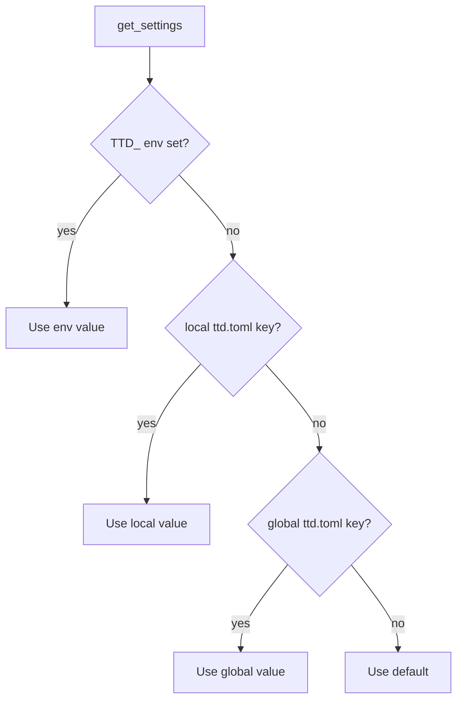

# M4 — Configuration (TOML + CLI)

## Summary

Add layered **TOML** configuration backed by **pydantic-settings**, with a global file at `{XDG_CONFIG_HOME}/ttd/ttd.toml` and an optional **local** `ttd.toml` discovered by walking up from the current working directory (nearest file wins). Expose read/write via **`ttd config show|get|set`**. v1 keys cover ledger paths (`data_dir`, `db_filename`) and display prefs (`timezone`, `clock_format`) — stored and editable now; **consuming** timezone/clock prefs in log/list/display is a follow-up milestone (see `brainstorms/2026-05-26-config-setup-requirements.md` for time-parse behavior).

---

## Problem Frame

Today `Settings` only loads `TTD_*` env vars and optional cwd `.env`; paths default to `~/.local/share/ttd/ttd.db` with no persistent, user-editable config file. `ttd db` shows paths but there is no `ttd config` namespace. Machine preferences should live outside the ledger DB, survive `ttd db reset`, and support per-repo overrides (e.g. different data dirs for work vs personal checkouts) without env-var scripting.

---

## Actors

- A1. **Solo developer:** Inspects and adjusts TTD machine/repo settings without hand-editing TOML or exporting env vars.
- A2. **Implementer:** Extends `Settings` and CLI; all surfaces read the same `get_settings()` source.

---

## Key Flows

- F1. **Inspect effective configuration**
  - **Trigger:** User runs `ttd config show` or `ttd config get <key>`.
  - **Steps:** Load settings with full precedence → print effective values (Rich table for `show`; single value for `get`).
  - **Outcome:** User sees what TTD will use, including which layer supplied each value when helpful.

- F2. **Set a local override**
  - **Trigger:** User runs `ttd config set data_dir ./.local/ttd` from a repo checkout.
  - **Steps:** Resolve nearest local target (create `ttd.toml` in cwd if none found walking up) → validate key/value via `Settings` → write TOML → confirm.
  - **Outcome:** Subsequent commands from that tree use the local data dir unless env overrides.

- F3. **Set a global default**
  - **Trigger:** User runs `ttd config set timezone America/Chicago --global`.
  - **Steps:** Write `{XDG_CONFIG_HOME}/ttd/ttd.toml` (create parents if needed) → validate → confirm.
  - **Outcome:** Default prefs apply when no local file overrides the key.

---

## Requirements

**Config files and discovery**

- R1. **Global config file:** `{XDG_CONFIG_HOME}/ttd/ttd.toml` (typically `~/.config/ttd/ttd.toml`). Create parent directory on first write if missing.
- R2. **Local config file:** filename **`ttd.toml`**. Discovery walks from **cwd toward filesystem root**; the **nearest** file found is the local layer. If none exists, the local layer contributes no values (until created by `config set`).
- R3. **Precedence (highest wins):** `TTD_*` environment variables → **local** `ttd.toml` (nearest walk-up) → **global** `ttd.toml` → built-in defaults. Optional cwd `.env` continues to feed env vars only (no new `.env` keys in v1).
- R4. **`Settings`** (pydantic-settings) loads TOML via pydantic-settings TOML source(s). Derived properties **`db_path`** and **`db_dsn`** remain on the model.
- R5. **`get_settings()`** returns effective settings for the current process; `config set` documents that existing shell processes need a new invocation to pick up file changes (no daemon in v1).

**v1 keys**

- R6. **`data_dir`** — ledger data directory (default `~/.local/share/ttd`).
- R7. **`db_filename`** — SQLite filename within `data_dir` (default `ttd.db`).
- R8. **`timezone`** — IANA timezone string (e.g. `America/Chicago`); stored and editable in v1; **not consumed** by log/list until the timezone follow-up milestone.
- R9. **`clock_format`** — `12h` or `24h`; stored and editable in v1; **not consumed** by display until the timezone follow-up milestone.

**`ttd config` commands (thin CLI adapters)**

- R10. **`ttd config show`** — print all v1 keys with **effective** values; include config file paths (global, local if found) and, where practical, the **winning layer** per key.
- R11. **`ttd config get <key>`** — print one effective value (scriptable stdout, no Rich).
- R12. **`ttd config set <key> <value>`** — validate via `Settings`, then write to the **local** layer by default (create nearest/cwd `ttd.toml` if needed).
- R13. **`ttd config set --global <key> <value>`** — write to the global config file instead of local.
- R14. Unknown keys or invalid values fail with clear errors; validation lives in core `Settings`, not duplicated in CLI.

**Integration**

- R15. **`ttd db *`** and all DB init paths use the same `get_settings()` source for `data_dir` / `db_path`.
- R16. No requirement to block other commands when config files are missing; defaults apply until the user sets values.

---

## Acceptance Examples

- AE1. **Covers R1, R13.** Given no config files, when user runs `ttd config set --global data_dir /var/ttd`, then `~/.config/ttd/ttd.toml` exists and `ttd config get data_dir` prints `/var/ttd`.
- AE2. **Covers R2, R3, R12.** Given global `data_dir = "/global"` and `./ttd.toml` with `data_dir = "./local"`, when user runs `ttd config get data_dir` from that directory, then output is `./local` (resolved path).
- AE3. **Covers R3.** Given local and global TOML values and `TTD_DATA_DIR=/env` in the environment, when user runs `ttd config get data_dir`, then output is `/env`.
- AE4. **Covers R10.** Given both layers exist, when user runs `ttd config show`, then output lists effective values and indicates global vs local file paths.
- AE5. **Covers R8, R9.** Given user runs `ttd config set timezone UTC` and `ttd config set clock_format 24h`, then values persist in local TOML and round-trip through `get` even before log/list consume them.

---

## Success Criteria

- Users can inspect and change ledger path and display prefs without editing TOML by hand or permanent env exports.
- Per-repo `ttd.toml` overrides global defaults for shared-machine / multi-checkout workflows.
- `ttd config get` is scriptable; `ttd config show` is human-friendly.
- Roadmap reflects **M4 Configuration** as the next milestone; data trust and later surfaces shift accordingly.

---

## Scope Boundaries

- **Timezone / flexible time parse / pendulum / `config init` wizard** — follow-up milestone (see `brainstorms/2026-05-26-config-setup-requirements.md` for behavior; builds on keys stored here)
- Cloud sync or merge of config across devices
- Per-project or per-client timezone (single machine prefs in v1)
- API/TUI config editors (CLI + core first)
- Keys beyond R6–R9 (rates, rounding, export defaults) — use entity commands or defer
- Hard-require config file before first `log` (hint-only at most in v1)

---

## Key Decisions

- **Fresh infra milestone** — config file layers + CLI only; decouple from timezone consumption.
- **Command namespace:** `ttd config show|get|set` (no `init` in M4).
- **Local discovery:** nearest `ttd.toml` on walk-up from cwd (single file, not merged ancestors).
- **Precedence:** env → local → global → defaults.
- **`config set` target:** local by default; `--global` for global file.
- **Roadmap:** insert as **M4 Configuration**; shift prior M4–M8 → M5–M9.

---

## Dependencies / Assumptions

- Python 3.14, existing `pydantic-settings`; TOML read via pydantic-settings; write strategy (full rewrite vs comment-preserving) deferred to planning.
- `tzdata` / system zoneinfo available for validating `timezone` strings at set time.
- Existing `ttd db` commands remain the place for DB maintenance; config owns paths only.

---

## Outstanding Questions

### Deferred to Planning

- [Affects R12][Technical] TOML write strategy: rewrite whole file from model vs preserve comments (`tomlkit`).
- [Affects R10][UX] Exact `show` columns (source layer per key vs footnote with paths only).
- [Affects R2][Technical] Stop walk at git root vs filesystem root (recommend filesystem root for v1; git boundary is optional enhancement).

### Resolve Before Planning

_None — pending user review of this document._

---

## Reference — settings precedence

