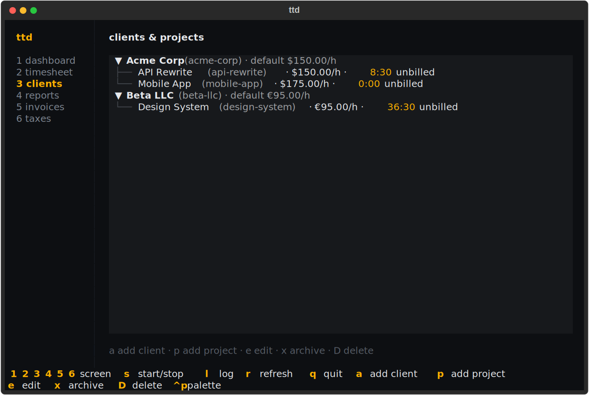

# Clients & projects

Work is organized two levels deep: **clients** you bill, and **projects**
under them that you log time against. Both are referred to everywhere by
their **slug** — a short kebab-case id generated from the name (`Acme Corp` →
`acme-corp`) that you can override with `--slug`.

## Clients

### Adding a client

```console
$ ttd client add "Acme Corp" --rate 150 --email billing@acme.example
✓ acme-corp
```

`--rate` sets the client's default hourly rate, `--currency` its currency
(defaults to `business.currency`, USD out of the box). `--contact`,
`--email`, and `--address` appear in the BILL TO block of invoices.
`ttd client add -i` asks for all of it in a form.

### Listing and editing

```console
$ ttd client list             # add --archived to include archived clients
$ ttd client edit acme-corp --rate 175 --contact "Jane Doe"
```

### Archiving vs deleting

- `ttd client archive SLUG` hides the client from lists and pickers; all
  history (entries, invoices) is kept. This is almost always what you want.
- `ttd client rm SLUG` deletes. It refuses if the client has projects;
  `--force` deletes the projects and their entries too. Gone is gone.

## Projects

### Adding a project

```console
$ ttd project add "API Rewrite" --client acme-corp
✓ api-rewrite
```

Without `--rate`, the project inherits the client's rate (project lists show
that as "(client)"). With `defaults.client` set in config, `--client` is
optional.

### Listing, editing, archiving

```console
$ ttd project list                    # hours logged + unbilled work per project
$ ttd project list --client acme-corp
$ ttd project edit api-rewrite --rate 175
$ ttd project archive api-rewrite
$ ttd project rm api-rewrite --client acme-corp          # empty project only
$ ttd project rm api-rewrite --client acme-corp --force # deletes entries too
```

Deleting a project with logged entries requires `--force`. Invoiced entries
block deletion even with `--force` — void the invoice first.

## How hourly rates resolve

When an invoice prices an hour of work, the rate comes from the first level
that defines one:

1. the **project**'s rate, if set
2. otherwise the **client**'s rate
3. otherwise `business.default_hourly_rate` from config

If none of the three is set, invoice creation fails rather than billing at
zero. The resolved rate is **frozen onto the invoice** at creation — editing
rates later never changes existing invoices.

## Default client and project

Set-and-forget for single-client stretches:

```console
$ ttd config set defaults.client acme-corp
$ ttd config set defaults.project api-rewrite
```

Now `ttd log "2h"` and `ttd start` need no flags. Combined with a per-repo
`.ttd.toml`, each codebase can map to its own project — see
[Configuration](configuration.md#per-project-config-with-ttdtoml).

## Interactive forms

Every creating/editing command accepts `-i` to open a form; flags you pass
pre-fill it. Useful when you don't remember the option names.

## Managing from the TUI

Screen `3` shows the portfolio as a tree — clients with their projects,
rates, and unbilled hours:



| Key | Action |
| --- | --- |
| `a` | add a client |
| `p` | add a project under the selected client |
| `e` | edit the selected client/project |
| `x` | archive the selected item |
| `D` | delete the selected item (confirms first) |
