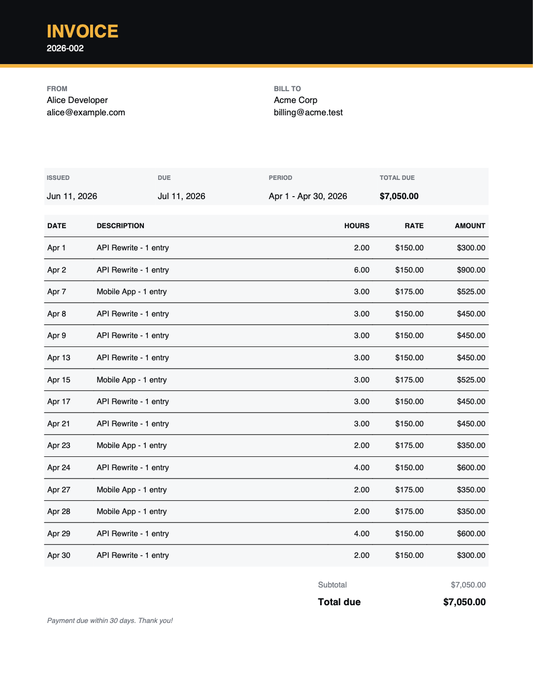

# Invoicing

From unbilled hours to a client-ready PDF in one command — with the billing
math explicit and the history immutable.

## How an invoice is built

`invoice create` gathers the client's **uninvoiced, billable** entries in the
period and groups them into line items — one per project per day (e.g.
"API Rewrite — 3 entries"). Each line's duration is rounded per your
[billing config](#billing-rounding), priced at the
[resolved rate](clients-and-projects.md#how-hourly-rates-resolve), and the
rate is frozen onto the invoice so later rate changes never rewrite history.

## Creating an invoice

```console
$ ttd invoice create --client acme-corp              # last calendar month
$ ttd invoice create --client acme-corp --month 2026-05
$ ttd invoice create --client acme-corp --from 2026-05-15 --to 2026-05-31
$ ttd invoice create --client acme-corp --number 2026-CUSTOM-1
```

`-i` opens a form with a live total preview instead.

### Preview with --dry-run

```console
$ ttd invoice create --client acme-corp --dry-run
```

Prints the line items, subtotal, tax, and total — and changes nothing. When
`tax.set_aside_rate` is set, the preview also shows how much to set aside and
the estimated take-home (subtotal minus set-aside).

## Rendering PDF and Markdown

Render at creation time with `--pdf` and/or `--md`, or any time later:

```console
$ ttd invoice create --client acme-corp --pdf --md
$ ttd invoice render 2026-001                 # re-render both
$ ttd invoice render 2026-001 --pdf --out ~/Desktop
```

Files are named `{number}-{client-slug}.pdf` / `.md` and written to
`invoice.output_dir` (`~/Documents/invoices` by default). The PDF is a clean
single-page letterhead layout; the Markdown comes from a template, handy for
pasting into email or converting with pandoc.



## The invoice lifecycle

| Status | Meaning |
| --- | --- |
| `draft` | Created; entries are locked to it |
| `sent` | Issued to the client |
| `paid` | Payment received — **tax set-aside is frozen at this moment** |
| `void` | Cancelled — **its entries are released** for re-invoicing |

```console
$ ttd invoice mark 2026-001 sent
$ ttd invoice mark 2026-001 paid --paid-date 2026-06-09
$ ttd invoice mark 2026-001 void
```

`--paid-date` defaults to today; correcting it re-freezes the set-aside into
the right tax quarter. Voided invoices keep their number forever — numbers
are never reused.

## Reviewing invoices

```console
$ ttd invoice list            # newest first: number, client, period, total, status
$ ttd invoice show 2026-001   # line items, dates, subtotal/tax/total, set-aside
```

When `tax.set_aside_rate` is greater than zero, `invoice list` also shows
**Est. Tax** and **Take-Home** columns. Unpaid invoices preview at the current
rate (shown muted); paid invoices use the frozen snapshot from when they were
marked paid. With the rate at `0` (the default), those columns are omitted.

`invoice show` includes the same set-aside and take-home figures — a preview
for open invoices, frozen amounts for paid ones.

## Invoice numbering

Numbers come from the `invoice.number_format` template — default
`{year}-{seq:03d}` → `2026-001`, `2026-002`, … The sequence increments within
whatever fields you use:

```console
$ ttd config set invoice.number_format "{year}{month:02d}-{seq:02d}"   # 202606-01
```

Available fields: `{year}`, `{month}`, `{seq}`.

## Customizing your invoices

All in [config](../reference/configuration.md):

- `user.name` / `user.email` / `user.address` — the FROM block
- `invoice.payment_terms_days` — due date, 30 days by default
- `invoice.tax_rate` — tax added to the subtotal, as a fraction (`0.08` = 8%)
- `invoice.output_dir` — where rendered files go
- `business.currency` (and per-client currency) — amounts and symbols

## Billing rounding

Rounding applies to each line item's rolled-up daily duration:

- `billing.increment_minutes` — the granularity, 15 minutes by default
- `billing.rounding` — `nearest` (default), `up`, or `none`

A project-day totalling **1h07m** bills as **1h00m** with `nearest`, **1h15m**
with `up`, and exactly **1h07m** with `none`. What you log is never changed —
only what's billed.

## Refreshing an invoice

Recompute an existing invoice from its **locked entries** using current billing
rules, rates, tax config, and description logic (including entry notes). Preview
shows a before/after diff; nothing changes until you confirm.

```console
$ ttd invoice refresh 2026-001              # print diff
$ ttd invoice refresh 2026-001 --apply      # apply when allowed
```

| Status | Preview | Apply |
| --- | --- | --- |
| `void` | Blocked | — |
| `draft`, `sent` | Full recalc diff | Updates lines and invoice totals |
| `paid` | Full recalc diff | **Descriptions only** — apply is blocked when totals or line amounts would change |

Paid invoices never update `set_aside`, `paid_date`, or header totals. To change
billing on a paid invoice, void it and re-invoice.

Refresh does **not** pull in new uninvoiced entries or edit locked entry data.

## Invoices in the TUI

Screen `5` lists invoices with status pills. When a tax set-aside rate is
configured, the table also shows **est. tax** and **take-home** columns (dim
for unpaid previews, normal for paid). The detail modal (`o`) includes the same
estimates in its summary line.


| Key | Action |
| --- | --- |
| `n` | new invoice (pick client, live-preview period) |
| `o` | open line-item detail (with est. tax / take-home when configured) |
| `u` | refresh — recompute from locked entries (before/after diff) |
| `m` | preview the Markdown render |
| `e` | render PDF + Markdown files |
| `t` / `p` / `v` | mark sent / paid / void |
