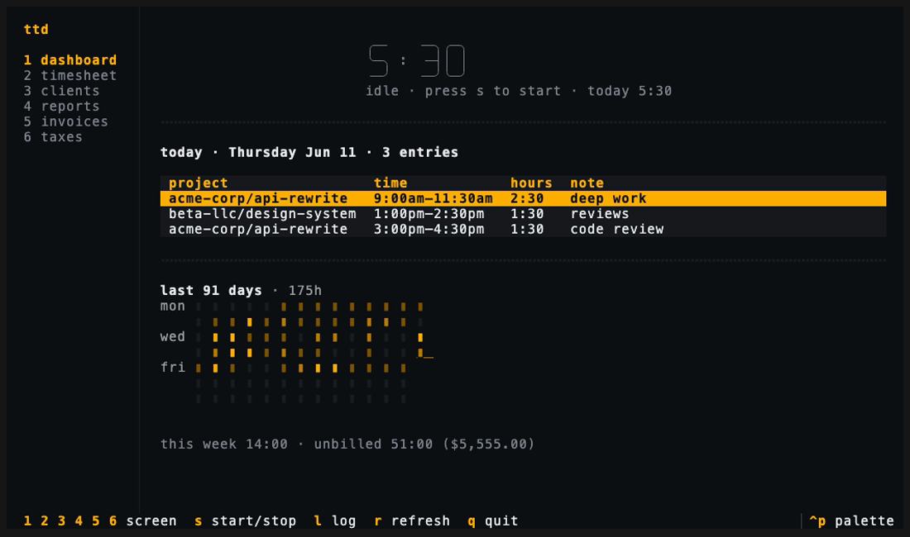
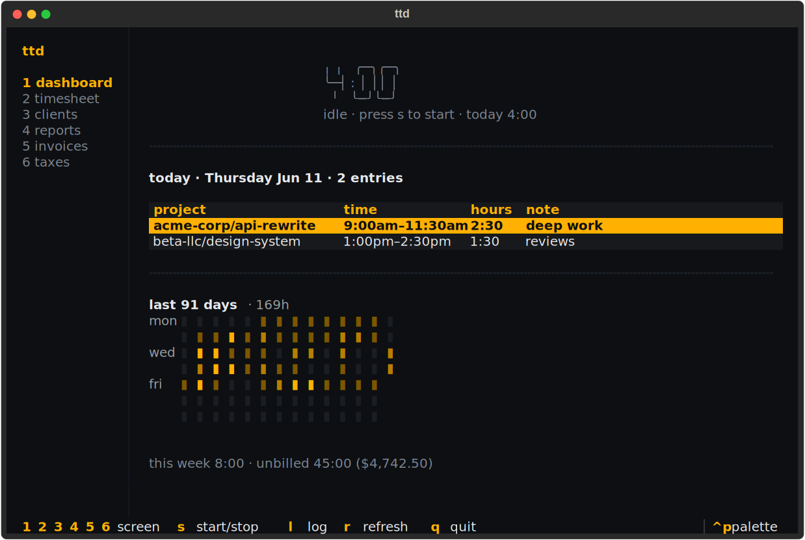
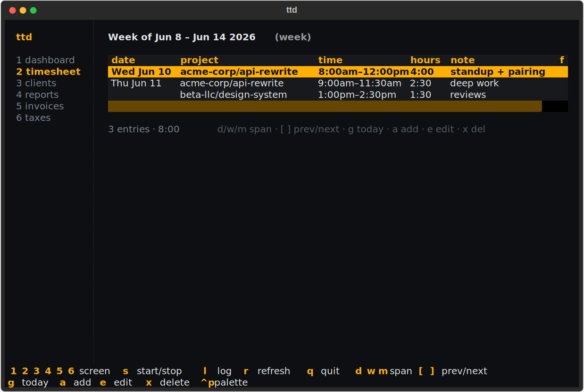
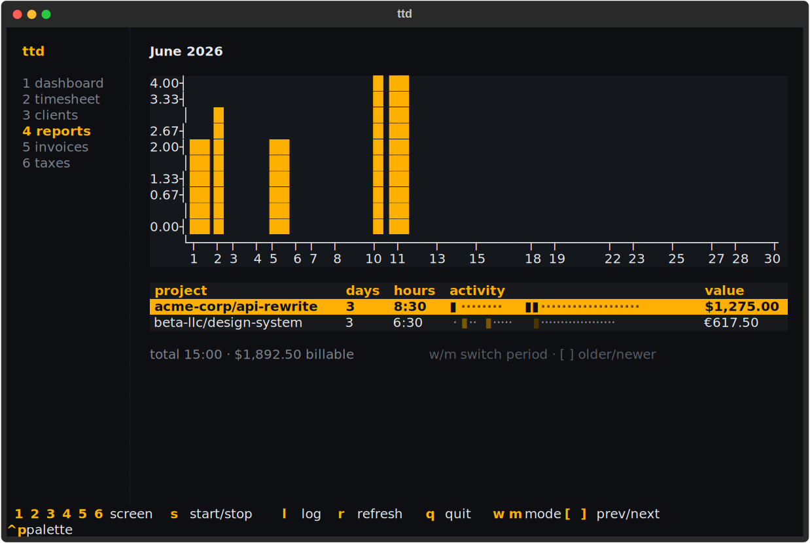
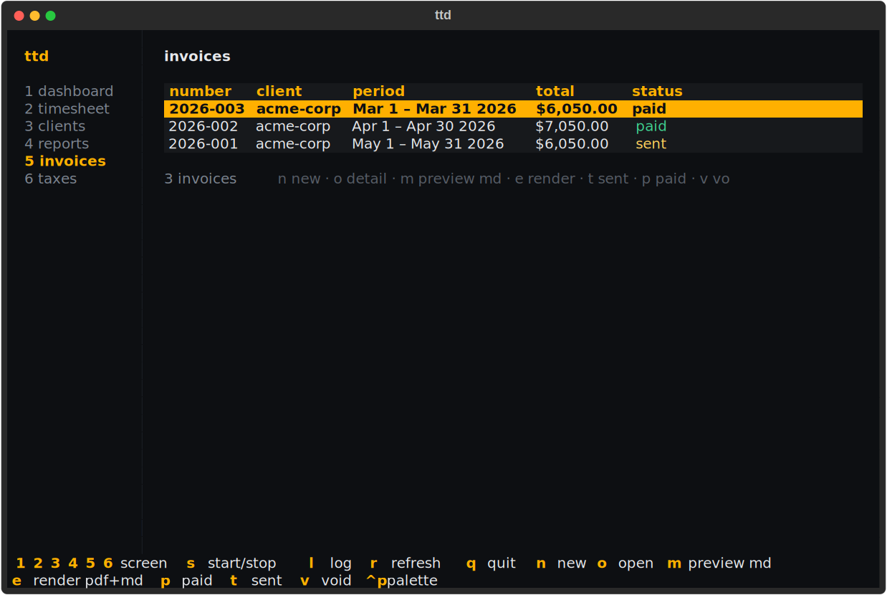
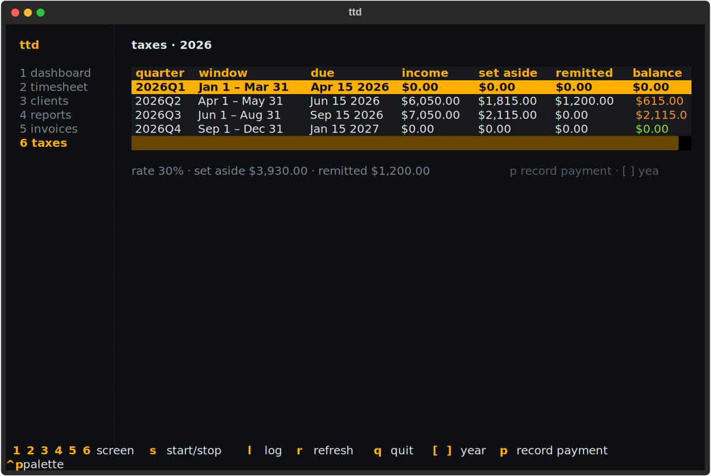
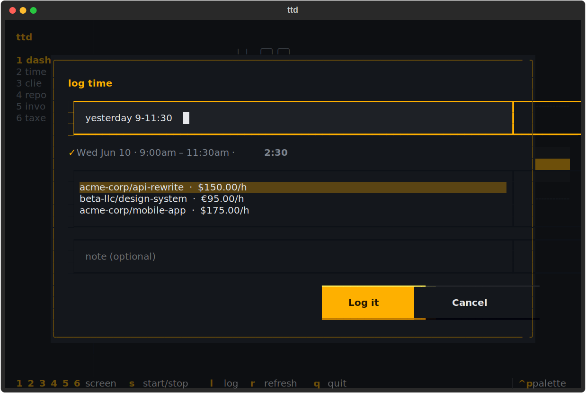
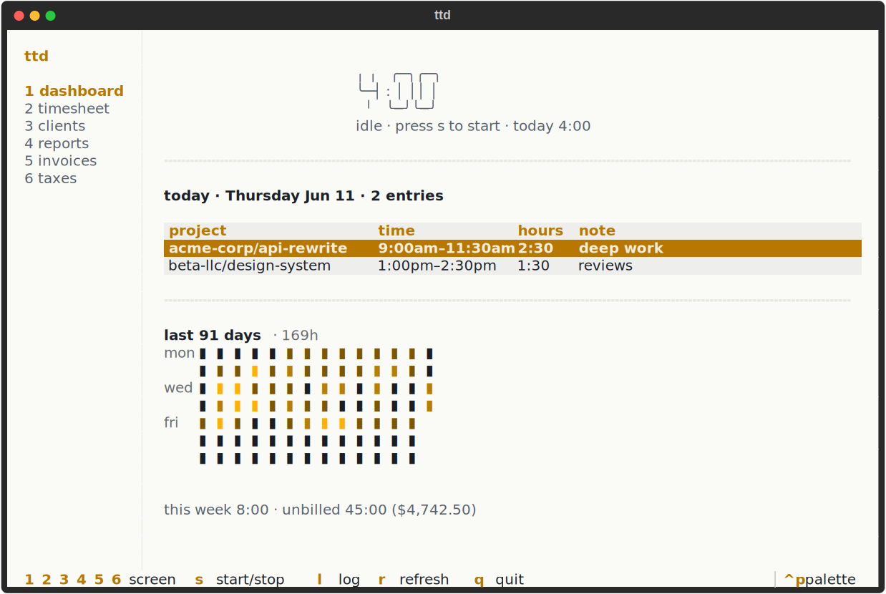

# The TUI

Run bare `ttd` and the full-screen interface opens — six screens covering
everything the CLI does, plus always-on timer and quick-log keys.



## Global keys

These work on every screen:

| Key | Action |
| --- | --- |
| `1` – `6` | switch screens (the nav rail shows the numbers) |
| `s` | start a timer / stop the running one |
| `l` | quick log — natural-language entry with live preview |
| `r` | refresh |
| `q` | quit |

The footer always shows every available key for the current screen — on
narrow terminals it wraps onto extra rows rather than hiding shortcuts.

## Dashboard

Screen `1`. The big timer (idle or running), today's entries, the week's
hours and unbilled value, and a 12-week activity heatmap:



## Timesheet

Screen `2`. Entries grouped by day across a day/week/month span — add, edit,
and delete in place. Keys: `d`/`w`/`m` span, `[` `]` paging, `g` today, `a`
add, `e` edit, `x` delete.



## Clients

Screen `3`. The portfolio as a tree — clients, their projects, rates, and
unbilled hours. Keys: `a` add client, `p` add project, `e` edit, `x` archive,
`D` delete.


## Reports

Screen `4`. Weekly or monthly rollups with per-day bar chart and activity
heat strips. Keys: `w`/`m` mode, `[` `]` paging.



## Invoices

Screen `5`. Every invoice with its status pill; create, inspect, render, and
advance them without leaving the screen. When `tax.set_aside_rate` is set, the
list adds **est. tax** and **take-home** columns (dim until the invoice is
paid), and the detail modal shows the same figures. Keys: `n` new, `o` detail,
`m` markdown preview, `e` render files, `t` sent, `p` paid, `v` void.



## Taxes

Screen `6`. The quarterly set-aside dashboard. Keys: `p` record payment,
`[` `]` change year.



## Quick log and modals

`l` opens the quick-log form anywhere: type a
[time expression](../reference/time-expressions.md), watch the live parse
preview confirm what will be logged, pick the project, add a note:



Forms submit with ++enter++ and cancel with ++escape++; confirmation dialogs
accept `y`; pickers are arrow-key lists.

## Themes

Two built-in themes, switched via config:

```console
$ ttd config set display.theme ttd-light    # or ttd-dark (default)
```



## Full key reference

Every key on every screen, in one table:
[Keyboard shortcuts](../reference/keyboard-shortcuts.md).
