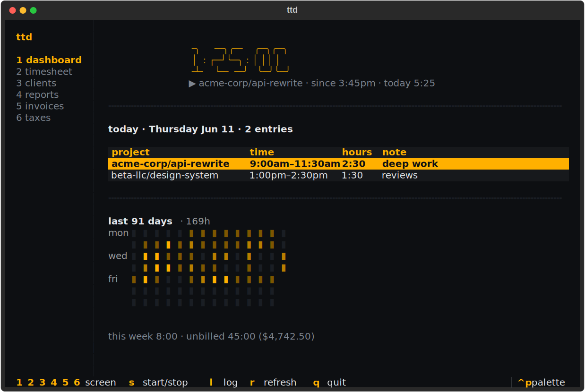

# Tracking time

An entry is a chunk of work on one project on one day: the date, an optional
start/end time (timer- and interval-logged entries have one; duration-only
entries don't), the duration, a note, optional tags, and whether it's
billable. Entries are what reports summarize and invoices bill.

## Live timers

### Start, stop, status, cancel

```console
$ ttd start api-rewrite          # project slug; --client disambiguates if needed
$ ttd status                     # elapsed time + today's total
$ ttd stop -n "auth endpoints"   # logs the entry
$ ttd cancel                     # discard without logging
```

ttd keeps **at most one timer running**. `ttd start` with no project uses
`defaults.project` from [config](configuration.md); otherwise it tells you to
pass one.

### Backdating with --at

Forgot to start or stop on time? Both commands take a clock time:

```console
$ ttd start api-rewrite --at 8:30
$ ttd stop --at 5pm
```

Bare hours like `5` resolve to am/pm using your configured workday window
(7:00–19:00 by default) — see [Time expressions](../reference/time-expressions.md).

### Timers in the TUI

Press `s` on any TUI screen to start a timer (it asks which project) or stop
the running one. The dashboard shows the running timer front and center:



## Logging time after the fact

### The log command

`ttd log` takes one quoted time expression covering the date and the time:

```console
$ ttd log "today 9am to noon" -p api-rewrite
$ ttd log "yesterday 2h30m" -p api-rewrite          # duration only, no clock times
$ ttd log "monday 1pm for 3 hours" -p api-rewrite   # most recent monday
$ ttd log "2026-06-03 9-11:30" -p api-rewrite       # explicit date, time range
$ ttd log "3h at 9am" -p api-rewrite                # duration anchored at a time
```


### Choosing project and client

`-p/--project` takes a project slug; add `--client` when the same project
slug exists under two clients. If you set `defaults.project` (or
`defaults.client`) in config, you can omit them entirely — handy with a
per-repo `.ttd.toml` (see [Configuration](configuration.md)).

### Notes, tags, and billable

```console
$ ttd log "2h" -p api-rewrite -n "code review" --tags deep-work,backend
$ ttd log "1h" -p api-rewrite --billable false     # tracked but never invoiced
```

New entries are billable by default (`defaults.billable`). Non-billable
entries show up in lists and reports (marked `nb`) but never on invoices.

### Interactive logging

`ttd log -i` opens a form; any flags you did pass pre-fill it.

## Validation: overlaps, ambiguity, limits

ttd refuses to log silently wrong data:

- **Overlaps** — an interval that collides with an existing entry on the same
  project and day is rejected; pass `--force` to log it anyway.
  Duration-only entries have no clock range and can't collide.
- **Ambiguity** — "6 to 8" could be morning or evening; if the workday window
  can't settle it, ttd rejects the expression and shows the readings it
  considered.
- **Future dates are rejected**, and a single entry can't exceed 14 hours.

## Quick log in the TUI

Press `l` on any screen. The form parses your expression as you type and
shows exactly what would be logged before you commit:


## Where entries come from

Every entry records its source — `timer`, `log`, `import`, or `tui` — so you
can always tell how something got into the ledger (it's in
[exports](import-export.md) too).

## Learn the full time language

Dates, weekday names, part-of-day words, 12/24-hour clocks, durations — the
complete grammar with a cookbook of examples:
[Time expressions](../reference/time-expressions.md).
