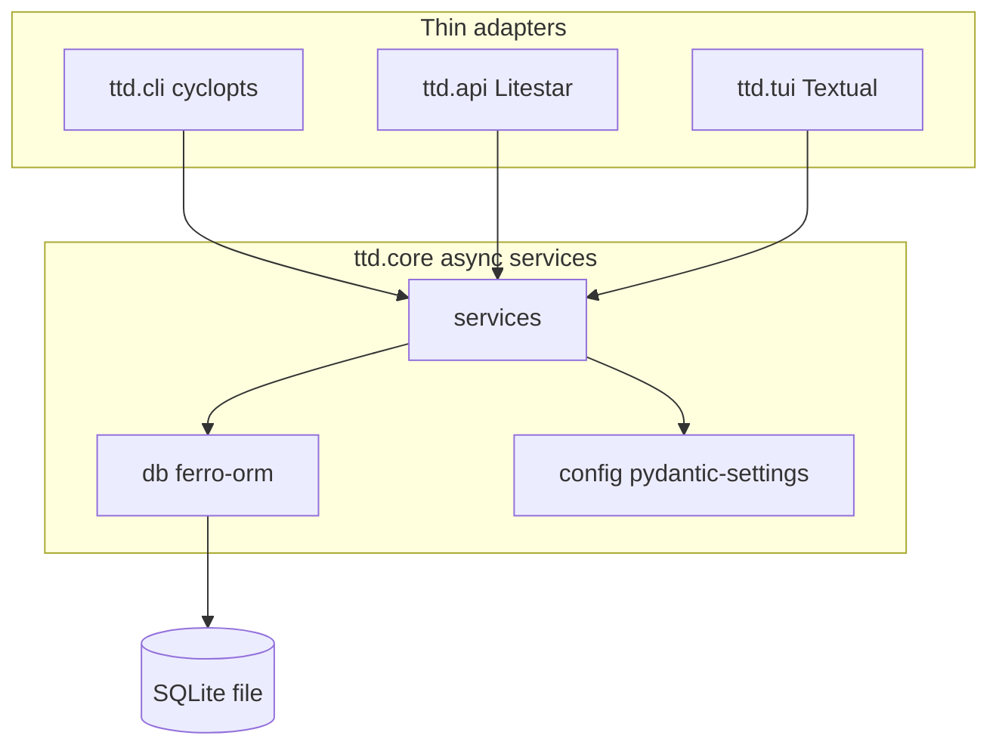

# feat: Foundational Python tech stack

## Summary

Bootstrap TTD as a uv-managed Python 3.14 project with a src-layout `ttd` package (`core`, `cli`, `api`, `tui`), async service boundaries, ferro-orm SQLite wiring stub, dev tooling parity (ruff, ty, pytest, Prek, Zensical), GitHub Actions CI on PR/main, and a manual release workflow (commitizen → PyPI → GitHub Pages).

---

## Problem Frame

The repo has product strategy and stack requirements but zero application code, manifests, or CI. This plan implements the foundation so billing-ledger work can start without re-deciding layout, async model, or release mechanics (see origin).

---

## Requirements

- R1. Python 3.14 runtime and CI baseline (origin)
- R2. uv for dependencies and lockfile (origin)
- R3–R5. Single package, namespace subpackages, core-only domain logic, thin surface adapters (origin)
- R6–R7. ferro-orm SQLite, async service layer (origin)
- R8. pydantic + pydantic-settings (origin)
- R9–R11. ruff, ty, Prek, Zensical docs build in CI (origin)
- R12. pytest + Hypothesis dependency wired; property tests deferred until billing logic exists (origin)
- R13–R15. GitHub Actions on PR/main; conventional commits enforced; no per-PR CHANGELOG (origin)
- R16–R18. Manual release workflow; PyPI publish; install via `uv tool install` / `uvx` (origin)

**Origin acceptance examples:** AE1 (lint blocks PR), AE2 (no CHANGELOG on PR), AE3 (manual release publishes PyPI + Pages), AE4 (all surfaces start and delegate to core)

### Success Criteria Traceability

- SC1 (contributor local/CI parity) → U4 verification + U5 CI green
- SC2 (core invocable from CLI without refactor) → U3 tests + AE4
- SC3 (manual release produces PyPI artifact + docs) → U6 verification + AE3
- SC4 (planning unblocked for billing work) → satisfied by completing U1–U6

---

## Scope Boundaries

- Billing ledger models, export rules, rounding, CSV — product tracks (`STRATEGY.md`)
- Real Litestar routes or Textual screens beyond minimal health/placeholder — scaffold only
- ferro-orm schema migrations and Alembic revision workflow — spike note only; full workflow when ledger schema starts
- Homebrew / non-PyPI distribution
- Auto-release on merge to main
- uv workspace multi-package layout
- `AGENTS.md` content beyond a minimal contributor pointer (optional follow-up)

### Deferred to Follow-Up Work

- Branch protection rules on GitHub (document checklist; configure in repo settings manually)
- PyPI project name reservation if `ttd` is taken on PyPI
- Dependabot/Renovate for dependency updates

---

## Context & Research

### Relevant Code and Patterns

- Greenfield: no existing Python code. Requirements doc is the spec.
- `STRATEGY.md`: v1 is CLI-first; TUI/API scaffold-only aligns with "Not working on … TUI … in v1"

### Institutional Learnings

- No `docs/solutions/` yet — capture pitfalls with `/ce-compound` after foundation lands.

### External References

- [uv project config](https://docs.astral.sh/uv/concepts/projects/config/)
- [uv GitHub Actions](https://docs.astral.sh/uv/guides/integration/github/)
- [cyclopts async commands](https://cyclopts.readthedocs.io/en/latest/commands.html)
- [ferro-orm PyPI](https://pypi.org/project/ferro-orm/)
- [Prek configuration](https://prek.j178.dev/configuration/)
- [Zensical publish](https://zensical.org/docs/publish-your-site/)
- [commitizen GitHub Actions](https://commitizen-tools.github.io/commitizen/tutorials/github_actions/)
- [PyPI trusted publishing](https://docs.pypi.org/trusted-publishers/using-a-publisher/)

---

## Key Technical Decisions

- **Six implementation units, dependency-ordered:** bootstrap → core/db stub → surfaces → dev tooling → CI → release (see units below).
- **Coverage report-only in foundation:** `pytest-cov` reports in CI; no `fail_under` until billing tests exist — avoids blocking empty scaffold at 0%.
- **Conventional commits:** Prek `commit-msg` hook (`cz check`) + PR job validating PR title via semantic-pull-request action (squash-merge friendly) (origin R15, AE2).
- **Release on `main` only:** `workflow_dispatch` with no bump-level input — commitizen auto-determines semver bump from conventional commit history since last tag; then commits, tags, pushes, and publishes.
- **PyPI trusted publishing:** OIDC via `pypa/gh-action-pypi-publish`; no long-lived API token in secrets.
- **Prek as single check surface:** All quality gates (ruff, ty, pytest, docs build) are prek hooks in `prek.toml`. CI runs `prek run --all-files` after `prek install --prepare-hooks` — same hooks as local, entire repo. PR title semantic check remains a separate CI job (not a prek hook).
- **Console scripts:** `ttd` (CLI), `ttd-api` (Litestar runner), `ttd-tui` (Textual) — thin sync entrypoints.
- **SQLite path (stub):** pydantic-settings default under XDG data dir; `ttd.core.db` exposes async connect/disconnect helpers with `auto_migrate=True` for dev scaffold only — no ledger models yet.
- **ferro-orm spike in U2:** import + `connect` smoke test in CI to validate Python 3.14 wheel availability early.
- **First commit milestone:** end of U1 yields `uv sync` + `import ttd`; end of U3 yields `uv run ttd --help`.

---

## Open Questions

### Resolved During Planning

- **Coverage threshold:** Report-only until domain tests land; add `fail_under` in a later plan when billing logic has coverage.
- **PyPI auth:** Trusted publishing (OIDC), configured on PyPI project before first release.
- **Conventional commit PR check:** PR title semantic validation + local commit-msg hook; not "all commits must pass" alone (squash-merge pitfall).
- **Release git write-back:** `cz bump --yes` infers patch/minor/major from conventional commits; creates changelog commit + annotated tag on `main`, pushed before PyPI publish; workflow fails if publish fails (tag exists — maintainer fixes manually; document in release runbook).
- **Zensical:** `zensical.toml` at repo root, `docs/` source, `site/` build output ignored; Pages via GitHub Actions deploy-pages.
- **Prek config:** `prek.toml` (not legacy `.pre-commit-config.yaml` unless Prek requires compatibility layer).
- **R7 CLI async boundary:** cyclopts native async dispatch satisfies origin's "asyncio.run or equivalent async dispatch".
- **R14 on main:** conventional commits enforced via PR title check + branch protection requiring PRs; direct pushes to `main` are discouraged (solo-dev default; add push-commit `cz check` job if direct pushes become common).

### Deferred to Implementation

- Exact ferro-orm Alembic workflow when ledger schema is defined (auto_migrate vs revision-only).
- Whether `ttd` PyPI name is available — verify at first release attempt.
- ty/ruff rule strictness tuning after first CI green run.

---

## Output Structure

```text
.
├── .github/workflows/
│   ├── ci.yml
│   └── release.yml
├── .python-version
├── .gitignore
├── AGENTS.md
├── CHANGELOG.md
├── README.md
├── prek.toml
├── pyproject.toml
├── uv.lock
├── zensical.toml
├── docs/
│   ├── index.md
│   └── getting-started.md
├── src/ttd/
│   ├── __init__.py
│   ├── py.typed
│   ├── core/
│   │   ├── __init__.py
│   │   ├── config.py
│   │   ├── db.py
│   │   └── services/
│   │       ├── __init__.py
│   │       └── health.py
│   ├── cli/
│   │   └── main.py
│   ├── api/
│   │   └── app.py
│   └── tui/
│       └── app.py
└── tests/
    ├── conftest.py
    ├── test_health.py
    ├── test_cli_entry.py
    ├── test_api_entry.py
    └── test_tui_import.py
```

---

## High-Level Technical Design

> *Directional guidance for review, not implementation specification.*



All surfaces call `ttd.core.services.*` with `await`. cyclopts dispatches async CLI commands natively; Litestar lifespan initializes shared DB session via `ttd.core.db`; Textual `on_mount` may call async core helpers.

---

## Implementation Units

- U1. **Repository bootstrap**

**Goal:** Installable uv project skeleton with Python 3.14 pin and standard ignores.

**Requirements:** R1, R2

**Dependencies:** None

**Files:**
- Create: `pyproject.toml`, `.python-version`, `uv.lock`, `README.md`, `src/ttd/__init__.py`, `src/ttd/py.typed`, `.gitignore` (expand)
- Test: `tests/__init__.py` (empty placeholder)

**Approach:**
- `[build-system]` with `uv_build`
- `requires-python = ">=3.14"`, `name = "ttd"`, initial `version = "0.0.0"`
- Runtime deps: ferro-orm[alembic], cyclopts, litestar[standard], textual, pydantic, pydantic-settings
- Dev dependency group: ruff, ty, pytest, pytest-cov, pytest-asyncio, hypothesis, prek, commitizen, zensical
- Defer `[project.scripts]` to U3 (entry-point targets must exist before scripts are registered)
- Run `uv lock` and `uv sync`

**Patterns to follow:**
- uv src-layout defaults ([uv project layout](https://docs.astral.sh/uv/concepts/projects/layout/))

**Test scenarios:**
- Test expectation: none — manifest and layout only; verified by `uv sync` succeeding

**Verification:**
- `uv sync` completes; `python -c "import ttd"` succeeds after editable install

---

- U2. **Core layer — config, db stub, health service**

**Goal:** Async core with settings, ferro-orm connect stub, and a health service all surfaces can call.

**Requirements:** R6, R7, R8

**Dependencies:** U1

**Files:**
- Create: `src/ttd/core/__init__.py`, `src/ttd/core/config.py`, `src/ttd/core/db.py`, `src/ttd/core/services/__init__.py`, `src/ttd/core/services/health.py`
- Test: `tests/conftest.py`, `tests/test_health.py`

**Approach:**
- `Settings` via pydantic-settings (data dir path, db filename)
- `db.py`: async `init_db()` / `close_db()` wrapping `ferro.connect("sqlite:…", auto_migrate=True)` — no models yet
- `health.ping()` async returns structured status dict
- pytest-asyncio `asyncio_mode = auto` in pyproject

**Patterns to follow:**
- ferro-orm async connect pattern (origin assumption)

**Test scenarios:**
- Happy path: `await health.ping()` returns ok status without raising when DB path is temp/isolated
- Edge case: second `init_db()` is idempotent or raises clear error (pick one, document in test)
- Integration: use tmp_path for SQLite file in tests

**Verification:**
- `uv run pytest tests/test_health.py` passes
- ferro-orm Python 3.14 smoke covered by `tests/test_health.py` via prek pytest hook in CI

---

- U3. **Surface scaffolds — CLI, API, TUI**

**Goal:** Three entrypoints start, delegate to core health service; satisfy AE4.

**Requirements:** R3, R4, R5, R7

**Dependencies:** U2

**Files:**
- Create: `src/ttd/cli/main.py`, `src/ttd/api/app.py`, `src/ttd/tui/app.py`, subpackage `__init__.py` files
- Modify: `pyproject.toml` `[project.scripts]`
- Test: `tests/test_cli_entry.py`, `tests/test_api_entry.py`, `tests/test_tui_import.py`

**Approach:**
- CLI: cyclopts `App`, async `health` command calling `ttd.core.services.health`
- API: Litestar factory, `/health` route, lifespan calling `init_db`/`close_db`
- TUI: minimal Textual app showing static "TTD" placeholder; optional call to health on mount
- Entry points: `ttd`, `ttd-api`, `ttd-tui` as thin sync shims

**Patterns to follow:**
- cyclopts async command dispatch (no manual `asyncio.run` per command)

**Test scenarios:**
- Covers AE4. Happy path: invoke CLI main with `--help` exits 0
- Covers AE4. Happy path: import `create_app` from api module; Litestar app has `/health`
- Covers AE4. Happy path: import TUI app class without running full terminal loop (or subprocess smoke with timeout)
- Error path: CLI health command surfaces connection error when DB path invalid (mock or bad path)

**Verification:**
- `uv run ttd --help` works
- `uv run pytest tests/test_*_entry.py` passes

---

- U4. **Dev tooling — ruff, ty, pytest, Prek, Zensical**

**Goal:** Local dev commands match CI; docs build; hooks installed.

**Requirements:** R9, R10, R11, R12

**Dependencies:** U3

**Files:**
- Create: `prek.toml`, `zensical.toml`, `docs/index.md`, `docs/getting-started.md`, `CHANGELOG.md` (empty header), `AGENTS.md`
- Modify: `pyproject.toml` tool sections, `README.md`

**Approach:**
- `[tool.ruff]` target-version py314; `[tool.ty.environment]` python-version 3.14
- pytest addopts with coverage report (no fail_under)
- Hypothesis in dev deps; document in AGENTS.md for future billing tests
- Zensical: minimal site with getting-started (uv sync, prek install, run checks)
- **`prek.toml` defines all checks as local system hooks** (entry: `uv run …`): ruff check, ruff format --check, ty check, pytest, zensical build --clean
- `prek install` for git shims; commit-msg stage for commitizen (`cz check`)
- Contributors run `prek run --all-files` before opening a PR (same command CI uses)
- README documents: `uv sync`, `prek install`, `prek run --all-files`

**Patterns to follow:**
- [Prek common workflows](https://prek.j178.dev/usage/) — `prek run --all-files` for full-repo checks

**Test scenarios:**
- Happy path: `prek run --all-files` exits 0 on clean scaffold tree
- Happy path: individual hooks reachable via `prek run <hook-id>`

**Verification:**
- `prek run --all-files` succeeds on clean tree
- `site/` in `.gitignore`

---

- U5. **CI — PR and main**

**Goal:** Automated quality gates on every PR and push to main.

**Requirements:** R13, R14, R15, AE1, AE2

**Dependencies:** U4

**Files:**
- Create: `.github/workflows/ci.yml`

**Approach:**
- Triggers: `pull_request`, `push` to `main`
- **Primary job `checks`:** `astral-sh/setup-uv@v8` (python 3.14) → `uv sync --frozen --all-groups` → `prek install --prepare-hooks` → **`prek run --all-files`**
- **Secondary job `pr-title` (PRs only):** semantic-pull-request action for conventional commit titles (squash-merge friendly)
- No separate lint/test/docs jobs — prek hooks cover ruff, ty, pytest+coverage, and zensical build across the full repo
- No CHANGELOG diff check

**Patterns to follow:**
- [uv GitHub integration guide](https://docs.astral.sh/uv/guides/integration/github/)
- [prek-action](https://pypi.org/project/prek/) pattern: install prek, run `--all-files`

**Test scenarios:**
- Covers AE1. Integration: `prek run --all-files` failure (e.g., intentional lint violation) blocks CI `checks` job
- Covers AE2. Document expected PR behavior in `docs/getting-started.md` contributor section

**Verification:**
- CI workflow YAML is syntactically valid
- First PR/push to GitHub runs all jobs green on scaffold

---

- U6. **Release workflow — commitizen, PyPI, GitHub Pages**

**Goal:** Manual release publishes versioned package and docs.

**Requirements:** R16, R17, R18, AE3

**Dependencies:** U5

**Files:**
- Create: `.github/workflows/release.yml`
- Modify: `pyproject.toml` `[tool.commitizen]` or `.cz.toml`

**Approach:**
- Trigger: `workflow_dispatch` on `main` only (no inputs — bump level derived from commit history)
- Steps: checkout (fetch-depth 0) → uv sync → **`cz bump --yes`** (auto semver from conventional commits since last tag) → push commit + tag (PAT or elevated token if GITHUB_TOKEN cannot chain) → `uv build` → PyPI trusted publish → zensical build → deploy-pages
- commitizen `version_files` points at `pyproject.toml:project.version`
- Document maintainer runbook in README: configure PyPI trusted publisher, enable GitHub Pages (Actions source), trigger workflow

**Patterns to follow:**
- [commitizen GitHub Actions tutorial](https://commitizen-tools.github.io/commitizen/tutorials/github_actions/)
- [PyPI trusted publishers](https://docs.pypi.org/trusted-publishers/)

**Test scenarios:**
- Covers AE3. Integration: dry-run locally `uv build` produces wheel/sdist
- Error path: document recovery if PyPI publish fails after tag push (manual fix / yank policy)

**Verification:**
- Release workflow file valid; trusted publisher configured on PyPI (manual prerequisite)
- After first release: `uvx ttd@latest --help` installs and runs (post-publish smoke)

---

## System-Wide Impact

- **Interaction graph:** All surfaces depend on `ttd.core`; only core touches ferro-orm and settings.
- **Error propagation:** Surface adapters catch/log and exit non-zero; core raises domain errors upward (no swallowing in foundation).
- **State lifecycle risks:** SQLite single-writer — document that API+CLI concurrent use is unsupported in v1; WAL mode deferred.
- **API surface parity:** `/health` only on API; CLI `health` command; TUI placeholder — parity is structural delegation to core, not feature parity.
- **Integration coverage:** U5/U6 workflows prove end-to-end toolchain; U3 tests prove adapter → core path.
- **Unchanged invariants:** No billing domain behavior; `STRATEGY.md` v1 scope unchanged.

---

## Risks & Dependencies

| Risk | Mitigation |
|------|------------|
| Python 3.14 or ferro-orm wheels missing on GHA | U2 smoke import test; pin versions; document fallback only if CI fails |
| PyPI package name `ttd` taken | Verify before U6; use `ttd-ledger` or org namespace if needed |
| Release workflow token cannot push tag | Use `GH_PAT` secret or documented manual tag step |
| ferro-orm API churn in 0.10.x | Pin exact version in pyproject; upgrade in dedicated PR |
| Empty scaffold blocks coverage gate | Report-only policy until domain tests |
| Trusted publishing misconfiguration | Follow PyPI publisher checklist in README before first release |

---

## Documentation / Operational Notes

- `README.md`: contributor quickstart, CI parity commands, release runbook summary
- `docs/getting-started.md`: clone → uv sync → prek install → `prek run --all-files`
- `AGENTS.md`: namespace layout rule, async boundary, "domain logic only in core"
- GitHub repo settings: branch protection (require ci jobs), Pages from Actions, PyPI trusted publisher
- Initial commit and push to `syn54x/ttd` remote required before CI/release workflows execute

---

## Sources & References

- **Origin document:** [docs/brainstorms/2026-05-24-foundational-techstack-requirements.md](docs/brainstorms/2026-05-24-foundational-techstack-requirements.md)
- **Strategy:** [STRATEGY.md](STRATEGY.md)
- uv, cyclopts, ferro-orm, Litestar, Textual, Prek, Zensical, commitizen docs (see Context & Research)
