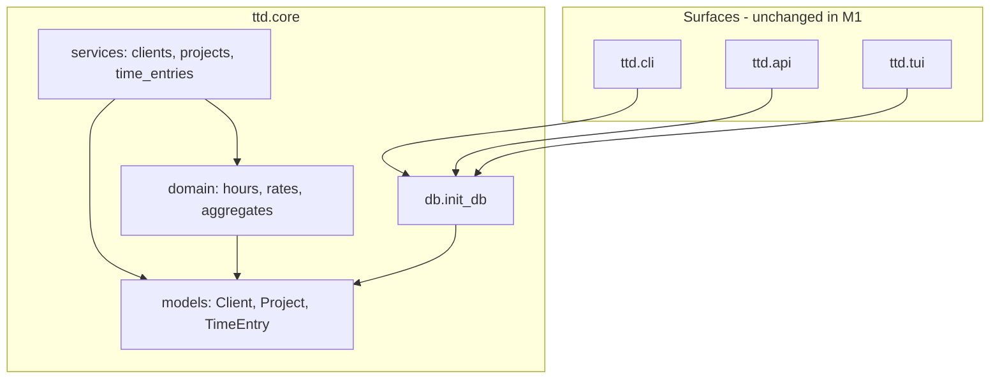

# feat: M1 billing ledger (core)

## Summary

Implement the billing ledger in `ttd.core`: ferro-orm models and schema applied via **`auto_migrate`** during active development; async CRUD services with rate inheritance, implied-rate and soft-max read helpers; and pytest + Hypothesis coverage. **Alembic revision files are deferred** until pre–user-testing (document the cutover in `docs/design/data-layer.md`). No CLI/API/TUI product commands — surfaces stay unchanged except continuing to call `init_db` after models register.

---

## Problem Frame

M0 left a SQLite connect stub with no domain schema. M1 is the first persisted ledger: the client → project → entry hierarchy, dual billing modes, and duration/interval entry semantics agreed in the requirements brainstorm must exist in core before M2 terminal capture or M3 export can build on them.

---

## Requirements

Requirements trace to origin R1–R20. This plan satisfies them via implementation units U1–U6.

**Origin actors:** A1 (solo developer / ledger owner), A2 (downstream surface implementer)

**Origin flows:** F1 (hourly client setup), F2 (fixed-price project tracking), F3 (retroactive entry via core services)

**Origin acceptance examples:** AE1–AE7 (rate inheritance, implied rate, billable sums, interval snapshot/recompute, soft-max non-block, fixed-price hour totals)

---

## Scope Boundaries

- CLI commands, TUI screens, Litestar ledger routes — M2–M7
- CSV export, rounding rules, billing period close — M3
- Soft-max user notifications — M2+ (threshold field and status helper in M1 only)
- Implied-rate analytics UI, tags, timers, cloud sync, team features
- Multi-currency FX conversion between clients
- Extra client metadata (email, address) unless needed during implementation for M2 — defer
- Changes to `ttd.cli`, `ttd.api`, `ttd.tui` beyond ensuring imports/`init_db` still work

### Deferred to Follow-Up Work

- **First Alembic revision** — generate `alembic/` + initial revision from models when approaching user testing (e.g. M2 dogfooding / first real local ledger), not during M1 implementation
- Update `docs/roadmap.md` M1 status to Done after implementation merges (note Alembic revision milestone moved to pre–user-testing if roadmap text still says “Alembic in M1”)
- `STRATEGY.md` optional one-line note that fixed-price tracking exists (product doc, not blocking M1 code)

---

## Context & Research

### Relevant Code and Patterns

- `src/ttd/core/db.py` — `connect(..., auto_migrate=True)` today; must import models before connect
- `src/ttd/core/config.py` — isolated DB per test via `Settings(data_dir=tmp_path)`
- `src/ttd/core/services/health.py` — thin async service pattern to mirror
- `docs/design/general.md` — `Decimal` for money/hours, raise in core, one subject per service module, `models/` + `services/` layout
- `plans/2026-05-24-001-feat-foundational-techstack-plan.md` — deferred Alembic until ledger schema (this plan)

### Institutional Learnings

- No `docs/solutions/` entries yet — first ledger implementation sets conventions; capture pitfalls via `/ce-compound` after M1.

### External References

- [ferro-orm PyPI](https://pypi.org/project/ferro-orm/) — async `Model`, `connect`, Alembic extra
- Origin requirements ERD: `brainstorms/2026-05-24-billing-ledger-requirements.md`

---

## Key Technical Decisions

- **Hours-canonical single `TimeEntry` model** with `entry_mode` discriminator (`duration` | `interval`); no synthetic timestamps for duration-only rows (see origin Key Decisions).
- **`Decimal` for rates, contract totals, and billable hours** — align with `docs/design/general.md`; avoid float money math.
- **UUID primary keys** on client, project, entry — stable ids for M2+ surfaces and export (R6).
- **Schema evolution during M1 (R18, user-directed):** Use ferro **`auto_migrate=True`** on `connect` for dev, tests, and dogfooding — no `alembic/` tree in M1. Document model conventions and the **Alembic cutover checklist** in `docs/design/data-layer.md` (when to freeze schema, generate initial revision from models, and switch long-lived DBs to `alembic upgrade head`). **Pre–user-testing:** add checked-in Alembic revision(s) before external/user-facing testing so schema changes are explicit and reviewable.
- **Model registration:** `src/ttd/core/models/__init__.py` imports all `Model` subclasses so metadata is complete before `init_db()`.
- **Timezone:** Store interval `started_at` / `ended_at` as timezone-aware UTC (`datetime` with `tzinfo=UTC`). Validate `ended_at > started_at`. **Allow overnight intervals** (end may be on a later calendar date than `work_date`); do not require interval bounds to fall on `work_date`.
- **Delete policy (origin OQ resolved):** Hard-delete time entries. Delete project only when it has no entries (`LookupError` or dedicated `ValidationError`). Delete client only when it has no projects. No soft-archive in M1.
- **Implied hourly rate when zero billable hours (AE3):** `implied_hourly_rate(project_id) -> ImpliedRate | None` — `None` when denominator is zero; no divide-by-zero.
- **Rate override atomicity:** Project hourly override sets **both** `hourly_rate` and `currency` together, or clears both to inherit (AE2).
- **Fixed-price validation:** Creating/updating fixed-price project requires `contract_total` + `currency`; hourly fields must be null. Hourly project forbids `contract_total`.
- **Pydantic DTOs** for service inputs/outputs where validation helps (`CreateClient`, `CreateEntry`, etc.); ferro models for persistence only.
- **Domain exceptions:** Small `ttd.core.exceptions` module (e.g. `NotFoundError`, `ValidationError`) — surfaces map later; core raises typed errors.

---

## Open Questions

### Resolved During Planning

- **Delete/archive:** Hard-delete with empty-child guards (see Key Technical Decisions).
- **Alembic vs auto_migrate:** M1 uses **auto_migrate only**; first Alembic revision deferred to pre–user-testing milestone (see Deferred to Follow-Up Work).
- **Timezone / overnight:** UTC-aware; end > start; overnight allowed.
- **Zero-hour implied rate:** Return `None`.

### Deferred to Implementation

- Exact ferro field types / relationship cascade kwargs after first model spike
- Whether `EntryMode` / `BillingMode` live in `enums.py` or on model modules
- Optimal Hypothesis strategy scope (single module vs split)

---

## Output Structure

```text
docs/design/
  data-layer.md                 # NEW — models + auto_migrate now; Alembic cutover later

src/ttd/core/
  exceptions.py                 # NEW
  db.py                       # MODIFY — import models; document connect policy
  models/
    __init__.py               # NEW — register all models
    enums.py                  # NEW
    client.py                 # NEW
    project.py                # NEW
    time_entry.py             # NEW
  domain/
    __init__.py               # NEW
    hours.py                  # NEW — interval → hours, recompute
    rates.py                  # NEW — effective rate, implied rate
    aggregates.py             # NEW — billable hour sums, soft-max status
  services/
    clients.py                # NEW
    projects.py               # NEW
    time_entries.py           # NEW

tests/
  conftest.py                 # MODIFY — db_session, factories
  core/
    test_clients.py           # NEW
    test_projects.py          # NEW
    test_time_entries.py      # NEW
    test_hours_hypothesis.py  # NEW
```

---

## High-Level Technical Design

> *Directional guidance for review, not implementation specification.*



**Entry write path (interval):** Service accepts draft → `domain.hours` computes duration from `(started_at, ended_at)` → persist `billable_hours` snapshot + timestamps → on update of bounds, recompute snapshot.

**Entry write path (duration):** Service accepts `billable_hours` + `work_date` → persist; `started_at`/`ended_at` remain null.

**Billing reads:** Hourly → `domain.rates.effective_rate(project)`. Fixed-price → `domain.rates.implied_rate(project)`; totals → `domain.aggregates.billable_hours(project)`.

---

## Implementation Units

- U1. **Data-layer conventions and model registration**

**Goal:** Document schema conventions and ensure models register before `connect` so `auto_migrate` creates tables reliably (R18 — policy documented; revision files deferred).

**Requirements:** R18

**Dependencies:** None

**Files:**
- Create: `docs/design/data-layer.md`
- Modify: `src/ttd/core/db.py`

**Approach:**
- Document: naming, UUID ids, `Decimal` columns, enum storage, **`auto_migrate` as the M1 default** for dev/tests
- Document **Alembic cutover** (trigger: approaching user testing): generate initial revision from models, check in `alembic/`, document `upgrade head` for non-throwaway DBs; optional note on resetting dev DBs vs migrating
- Ensure `db.py` imports `ttd.core.models` before `connect` so metadata registers; keep `auto_migrate=True`
- Fix duplicate `_db_initialized = False` in `close_db` while touching file
- Do **not** add `alembic/` or `alembic.ini` in M1

**Patterns to follow:**
- `plans/2026-05-24-001-feat-foundational-techstack-plan.md` U2 db stub

**Test scenarios:**
- Test expectation: none — verified by U2 tables appearing via `init_db`

**Verification:**
- `docs/design/data-layer.md` exists and describes auto_migrate-now / Alembic-later policy
- `db.py` imports models before `connect`

---

- U2. **Ledger models (auto_migrate)**

**Goal:** Persist Client, Project, TimeEntry with billing modes and entry modes; schema created by `auto_migrate` on connect (R1–R7, R12).

**Requirements:** R1–R7, R12, R18

**Dependencies:** U1

**Files:**
- Create: `src/ttd/core/models/__init__.py`, `enums.py`, `client.py`, `project.py`, `time_entry.py`
- Test: `tests/core/test_models_smoke.py` (optional thin import/metadata test) or covered by U4–U6

**Approach:**
- `BillingMode`: `hourly` | `fixed_price`
- `EntryMode`: `duration` | `interval`
- Client: `name`, `default_hourly_rate`, `currency` (unique `name` optional — enforce in service if DB unique deferred)
- Project: FK `client_id`, `name`, `billing_mode`, nullable `hourly_rate`/`currency`, nullable `contract_total`, nullable `soft_max_hours`; unique `(client_id, name)`
- TimeEntry: FK `project_id`, `work_date`, `entry_mode`, `billable_hours`, nullable `started_at`/`ended_at`, `billable` bool, nullable `note`
- DB constraints where ferro supports: e.g. interval mode requires start/end; duration forbids start/end
- Schema changes during M1: rely on `auto_migrate` (fresh tmp DB per test; dev may delete local `ttd.db` when model shape changes)

**Patterns to follow:**
- `docs/design/general.md` §3 — ferro `Model` + attribute docstrings where models are documented

**Test scenarios:**
- Happy path: metadata creates all three tables on fresh DB via `init_db(settings)`
- Edge case: fixed-price project row has null hourly rate columns
- Error path: N/A at model layer — validation in services (U4–U6)

**Verification:**
- Tables exist after `init_db` in isolated test settings
- No Alembic directory required for M1 CI green

---

- U3. **Domain helpers — hours, rates, aggregates**

**Goal:** Pure, testable billing math without persistence (R11, R14, R15, R16).

**Requirements:** R11, R14, R15, R16

**Dependencies:** U2 (enums/types only — no DB required for unit tests)

**Files:**
- Create: `src/ttd/core/exceptions.py`, `src/ttd/core/domain/__init__.py`, `hours.py`, `rates.py`, `aggregates.py`
- Test: `tests/core/test_domain_hours.py`, `tests/core/test_domain_rates.py`

**Approach:**
- `hours.duration_from_interval(start, end) -> Decimal` — fractional hours, consistent rounding (document rule: e.g. minute precision or full Decimal delta)
- `hours.recompute_interval_snapshot(start, end) -> Decimal` — used on entry update
- `rates.effective_hourly_rate(client, project) -> tuple[Decimal, str]` — hourly only; raise/ValidationError on fixed-price
- `rates.implied_hourly_rate(contract_total, currency, billable_hours_sum) -> ImpliedRate | None`
- `aggregates.sum_billable_hours(entries) -> Decimal` — excludes non-billable
- `aggregates.soft_max_status(total_hours, soft_max) -> enum/status` — e.g. `under` | `over` | `unset`

**Execution note:** Implement `test_hours_hypothesis.py` properties against `domain.hours` in U6; add minimal direct unit tests here.

**Patterns to follow:**
- `docs/design/general.md` — standalone functions when no shared state

**Test scenarios:**
- Covers AE1. Happy path: effective rate inherits client when project override null
- Covers AE2. Happy path: project override returns both overridden rate and currency
- Covers AE3. Happy path: implied rate 10000/40 = 250; Edge case: zero hours → None
- Covers AE5. Happy path: 09:00–12:30 → 3.5 hours; Edge case: overnight 22:00–02:00 → 4.0 hours
- Error path: effective rate on fixed-price project raises clear error

**Verification:**
- Domain tests pass without DB fixtures

---

- U4. **Client and project services**

**Goal:** Async CRUD + validation for clients and projects, including billing-mode rules (R1–R5, R13).

**Requirements:** R1–R5, R13, R14

**Dependencies:** U2, U3

**Files:**
- Create: `src/ttd/core/services/clients.py`, `projects.py`
- Test: `tests/core/test_clients.py`, `tests/core/test_projects.py`
- Modify: `tests/conftest.py` — `init_db` + optional `client_factory` / `project_factory`

**Approach:**
- Clients: create, get, list, update, delete (guard: no projects)
- Projects: create with mode-specific validation; list by client; update; delete (guard: no entries)
- Hourly create: optional rate/currency override fields
- Fixed-price create: require `contract_total` + `currency`
- Expose `get_effective_rate(project_id)` delegating to U3

**Patterns to follow:**
- `src/ttd/core/services/health.py` — async, `init_db` at service boundary or assume caller initialized

**Test scenarios:**
- Covers AE1, AE2. Happy path: hourly project inherits client rate
- Covers AE2. Happy path: override rate and currency together
- Covers F1. Integration: create client → hourly project → resolve effective rate
- Covers F2. Integration: create fixed-price project with contract total
- Error path: delete client with projects fails
- Error path: fixed-price project without contract total fails validation
- Edge case: soft_max_hours nullable; unset vs set

**Verification:**
- `tests/core/test_clients.py` and `test_projects.py` pass with isolated SQLite

---

- U5. **Time entry services**

**Goal:** Async CRUD for entries with duration/interval semantics and snapshot recompute (R7–R12, R13).

**Requirements:** R7–R12, R13

**Dependencies:** U3, U4

**Files:**
- Create: `src/ttd/core/services/time_entries.py`
- Test: `tests/core/test_time_entries.py`
- Modify: `tests/conftest.py` — entry helpers

**Approach:**
- Create duration entry: `work_date`, `billable_hours`, `billable`, optional `note`
- Create interval entry: compute snapshot via U3 before insert
- Update: changing interval bounds recomputes `billable_hours`; duration mode updates hours directly
- List/filter by project (and optional work_date range for future M3 — keep minimal in M1)
- Delete entry (hard delete)
- List entries returns stored snapshot (not live recompute on read unless bounds changed)

**Patterns to follow:**
- Raise `ValidationError` for interval with end <= start, wrong mode field population

**Test scenarios:**
- Covers AE4. Happy path: billable + non-billable sum excludes non-billable
- Covers AE5. Happy path: interval snapshot 3.5h; update end → 4.0h
- Covers AE6. Happy path: entry saves when project over soft-max (status via separate aggregate call in U6)
- Covers F3. Integration: duration entry + interval entry same project/day
- Error path: interval mode without start/end rejected
- Error path: duration mode with start/end rejected (or ignored — pick one, document in data-layer.md)

**Verification:**
- `tests/core/test_time_entries.py` passes

---

- U6. **Read helpers, Hypothesis properties, and service integration**

**Goal:** Ship implied rate, soft-max status, billable totals; property tests for hour invariants (R15, R16, R19, R20).

**Requirements:** R15, R16, R19, R20

**Dependencies:** U4, U5

**Files:**
- Modify: `src/ttd/core/services/projects.py` or `src/ttd/core/services/ledger.py` (thin read facade) — `implied_hourly_rate`, `project_hours_status`, `project_billable_hours`
- Test: `tests/core/test_ledger_reads.py`, `tests/core/test_hours_hypothesis.py`

**Approach:**
- `implied_hourly_rate(project_id)` loads project + sums billable hours → U3
- `project_hours_status(project_id)` compares sum to `soft_max_hours`
- `project_billable_hours(project_id)` for AE7 / export prep
- Hypothesis: round-trip interval times → snapshot hours monotonic in end time; recompute idempotent; duration entries unchanged when only note edited

**Execution note:** Implement Hypothesis tests test-first or alongside read helpers — billing-sensitive per AGENTS.md.

**Test scenarios:**
- Covers AE3. Integration: fixed-price project + 40h → implied $250/h
- Covers AE6. Integration: soft-max status `over` when hours exceed threshold; entry create still succeeds
- Covers AE7. Integration: fixed-price project totals are hours-only path
- Property: random valid intervals → snapshot matches `domain.hours` formula
- Property: editing end forward never decreases snapshotted hours

**Verification:**
- All `tests/core/` pass under `uv run pytest`
- `prek run --all-files` passes (CI parity)

---

## System-Wide Impact

- **Interaction graph:** `health.ping` and API lifespan still call `init_db` — must load new models; no new routes or CLI commands.
- **Error propagation:** Core raises `NotFoundError` / `ValidationError`; M2 adapters will map to exit codes/messages.
- **State lifecycle risks:** Tests must `close_db` between cases (`reset_db_state` fixture) to avoid stale engine across isolated DB paths.
- **API surface parity:** No HTTP ledger API in M1; parity deferred to M7.
- **Integration coverage:** U6 cross-service tests prove client → project → entries → aggregates path.
- **Unchanged invariants:** `ttd.cli`, `ttd.api`, `ttd.tui` entrypoints and health-only behavior; coverage `fail_under` still deferred to M4.

---

## Risks & Dependencies

| Risk | Mitigation |
|------|------------|
| ferro-orm 0.10.x API drift for models/migrations | Pin version; spike models in U2 early; upgrade in dedicated PR if needed |
| Schema drift on long-lived local DB during M1 | Document “delete dev DB or wait for Alembic cutover” in `data-layer.md`; tests always use fresh tmp paths |
| Late Alembic introduction surprises | Cutover checklist in `data-layer.md`; generate revision before user testing, not at M8 |
| Decimal/SQLite precision surprises | Use `Decimal` end-to-end; assert in Hypothesis with explicit quantize policy |
| Interval overnight vs `work_date` confusion | Document in data-layer.md; AE5-style tests for cross-midnight |
| Scope creep into CLI | Enforce scope boundaries; code review against requirements |

---

## Documentation / Operational Notes

- Add `docs/design/data-layer.md` — satisfies R18 “workflow defined” via auto_migrate-now + documented Alembic cutover (revision files land pre–user-testing, not in M1 code)
- Link plan `origin` from future M2 plan when CLI work starts
- No PyPI or user-facing doc changes required for M1

---

## Sources & References

- **Origin document:** [brainstorms/2026-05-24-billing-ledger-requirements.md](../brainstorms/2026-05-24-billing-ledger-requirements.md)
- **Roadmap:** [docs/roadmap.md](../docs/roadmap.md) (M1 section)
- **Strategy:** [STRATEGY.md](../STRATEGY.md)
- **Design:** [docs/design/general.md](../docs/design/general.md)
- **Foundation plan:** [plans/2026-05-24-001-feat-foundational-techstack-plan.md](2026-05-24-001-feat-foundational-techstack-plan.md)
- **Existing DB stub:** [src/ttd/core/db.py](../src/ttd/core/db.py)
