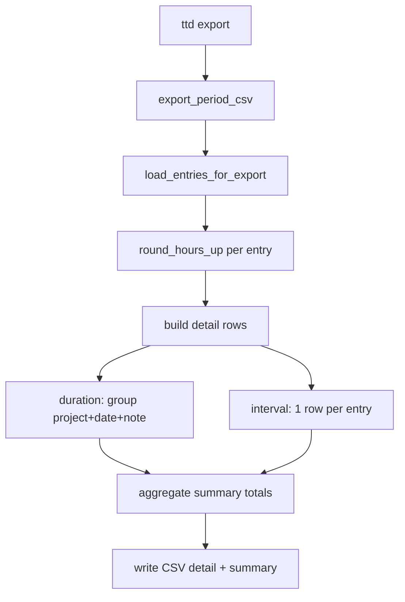

# feat: M3 export & period close (CSV)

## Summary

Implement M3 in `ttd.core` first: nullable rounding-increment fields on clients and projects with export-time round-up, a period entry loader with optional client/project filters, transform pipeline (duration rollup by project-day-note, interval rows as-is), CSV serialization with a trailing summary block, and a thin `ttd export` CLI. Extend client/project create-update paths so rounding can be configured without raw DB edits. All billing math stays in core; surfaces only parse, await, and write output.

---

## Problem Frame

M1/M2 ship the ledger and CLI capture; dogfooding still requires spreadsheet summing at period close. Origin requirements define the export shape, rounding inheritance, and hourly vs fixed-price column rules — this plan sequences schema, domain, services, CSV, and CLI without re-litigating product behavior.

---

## Requirements

Requirements trace to origin R1–R18. This plan satisfies them via implementation units U1–U7.

**Origin actors:** A1 (solo developer / ledger owner), A2 (downstream surface implementer)

**Origin flows:** F1 (close period for one client), F2 (export all clients in range), F3 (non-billable in export)

**Origin acceptance examples:** AE1–AE7 (period bounds, rounding, rollup, hourly/fixed columns, non-billable dollars, re-export immutability of stored hours)

---

## Scope Boundaries

- Named billing schedules (monthly, bi-weekly, 1st/15th) — follow-up after M3
- PDF/Markdown invoices, TUI/API export routes — M6, M5, M7
- Backup/restore, portable export, post-export audit — M4
- Hypothesis property suite for rounding (M4 roadmap); M3 uses targeted pytest only
- Mutating stored entry hours during export
- Multi-currency FX

### Deferred to Follow-Up Work

- **Alembic revision for rounding columns** — continue `auto_migrate` per M1 policy; add revision at pre–user-testing cutover, not in M3 PR unless dogfood DB needs manual note in `docs/design/data-layer.md`
- **Update `docs/roadmap.md` M3 → Done** after merge
- **Optional `just export-smoke`** — defer unless dogfood wants a canned period export shortcut

---

## Context & Research

### Relevant Code and Patterns

- `src/ttd/core/domain/rates.py` — `effective_hourly_rate()`; reuse for hourly dollar columns
- `src/ttd/core/domain/hours.py` — interval hour math (stored hours unchanged at export)
- `src/ttd/core/domain/aggregates.py` — `sum_billable_hours()` pattern for summary totals
- `src/ttd/core/services/time_entries.py` — per-project list today; export needs cross-ledger load
- `src/ttd/core/seed/runner.py` — client → project → entries iteration pattern
- `src/ttd/cli/entries_cmds.py` — `_filter_by_period`, `--from`/`--to`, `resolve_client`/`resolve_project`
- `src/ttd/cli/runtime.py` — `ensure_db`, `parse_date`, error mapping
- `brainstorms/2026-05-25-export-period-close-requirements.md` — authoritative WHAT
- `docs/design/general.md` — `services/export.py`, separate export DTOs, Decimal end-to-end

### Institutional Learnings

- No `docs/solutions/` entries yet — capture export/rounding pitfalls via `/ce-compound` after M3 if non-obvious issues surface (e.g. ferro enum hydration on new fields).

### External References

- Origin requirements: `brainstorms/2026-05-25-export-period-close-requirements.md`
- Roadmap M3: `docs/roadmap.md`

---

## Key Technical Decisions

- **`rounding_increment_minutes: int | None` on Client and Project** — `None` means no rounding (origin AE2). Positive integers only; validation rejects zero/negative. Project unset inherits client value at export (mirror rate inheritance).
- **`domain/rounding.py`** — pure `round_hours_up(hours, increment_minutes) -> Decimal` using Decimal math (increment as `Decimal(minutes) / 60`, round up via quantize ceiling). Keeps export service thin.
- **Export-time only** — never `save()` entries during export; re-export reflects edits without mutating prior snapshots (AE7).
- **Ledger load in core** — new `load_entries_for_export(period, client_id?, project_id?)` walks clients/projects like `seed/runner.py`, filters `work_date` in `[from, to]`, optional scope filters. Avoid duplicating filter logic in CLI.
- **Transform pipeline** — (1) attach client/project context per entry → (2) round each entry’s `billable_hours` → (3) emit interval rows 1:1 → (4) group duration rows by `(project_id, work_date, note)` and sum rounded hours → (5) compute row dollars for hourly + billable only.
- **CSV layout (plan-resolved)** — single file: `DETAIL` rows then blank line then `SUMMARY` rows (see High-Level Technical Design). Stable column order for spreadsheet import.
- **CLI command `ttd export`** — required `--from` and `--to`; optional `--client`, `--project`, `--project-id`, `--output` (stdout when omitted). Mirrors `entries list` filter flags where possible.
- **Rounding configuration UX** — extend existing `ttd client` / `ttd project` add/update with optional `--rounding-minutes` (and clear on update via omit or explicit null flag) so dogfooders need not patch SQLite.
- **No `RoundingService` class in M3** — module-level domain function + export service is enough (YAGNI vs `general.md` illustrative `LedgerService`).

---

## Open Questions

### Resolved During Planning

- **CSV columns and summary format:** Fixed column set in High-Level Technical Design; summary as typed rows after a blank separator.
- **No rounding representation:** `None` on client/project; never use `0` minutes as “no rounding.”
- **Blank-note merge:** Empty string notes group together; any non-empty note (including whitespace-only if distinct from `""`) splits rows per AE4 — normalize `note` as `entry.note or ""` for rollup key.
- **CLI name:** `ttd export` (not `close`).

### Deferred to Implementation

- Exact `quantize` scale for CSV hour/money display (recommend `0.01` for hours and money, document in `data-layer.md` export subsection)
- Whether whitespace-only notes trim to `""` for rollup (default: strip leading/trailing whitespace on note key only)
- Performance of full-ledger walk for large datasets (acceptable for solo-dev v1; no pagination in M3)

---

## High-Level Technical Design

> *This illustrates the intended approach and is directional guidance for review, not implementation specification. The implementing agent should treat it as context, not code to reproduce.*



**Detail row columns (order fixed):**

| Column | Notes |
|--------|--------|
| `row_type` | `DETAIL` |
| `client` | Name |
| `project` | Name |
| `work_date` | ISO date |
| `entry_mode` | `duration` or `interval` |
| `note` | Text; empty allowed |
| `time_from` | ISO time or empty (interval only) |
| `time_to` | ISO time or empty (interval only) |
| `billable` | `yes` / `no` |
| `hours` | Rounded export hours |
| `currency` | Empty for fixed-price; ISO code for hourly |
| `rate` | Empty for fixed-price; effective rate for hourly |
| `amount` | Empty for fixed-price or non-billable; `hours * rate` for billable hourly |

**Summary rows:** `row_type=SUMMARY`, `level=client|project`, names, `hours`, `amount` (hourly billable only), same period implicit.

---

## Output Structure

```text
src/ttd/core/
  domain/
    rounding.py                 # NEW
  schemas.py                    # MODIFY — rounding on client/project DTOs; export DTOs
  models/
    client.py                   # MODIFY — rounding_increment_minutes
    project.py                  # MODIFY — rounding_increment_minutes
  services/
    export.py                   # NEW — load, transform, CSV
    clients.py                  # MODIFY — persist rounding field
    projects.py                 # MODIFY — persist rounding field

src/ttd/cli/
  export_cmds.py                # NEW
  client_cmds.py                # MODIFY — --rounding-minutes
  project_cmds.py               # MODIFY — --rounding-minutes
  main.py                       # MODIFY — register export

tests/core/
  test_domain_rounding.py       # NEW
  test_export.py                # NEW

tests/cli/
  test_export.py                # NEW (or extend test_commands.py)

docs/design/
  data-layer.md                 # MODIFY — rounding + export columns subsection
```

---

## Implementation Units

- U1. **Rounding schema and domain**

**Goal:** Persist rounding configuration and provide pure round-up logic for export.

**Requirements:** R4, R5, R6, R7

**Dependencies:** None

**Files:**
- Create: `src/ttd/core/domain/rounding.py`
- Modify: `src/ttd/core/models/client.py`, `src/ttd/core/models/project.py`
- Modify: `src/ttd/core/schemas.py` (`CreateClient`, `UpdateClient`, `CreateProject`, `UpdateProject`)
- Modify: `src/ttd/core/services/clients.py`, `src/ttd/core/services/projects.py`
- Modify: `src/ttd/cli/client_cmds.py`, `src/ttd/cli/project_cmds.py`
- Test: `tests/core/test_domain_rounding.py`
- Modify: `tests/core/test_clients.py`, `tests/core/test_projects.py`

**Approach:**
- Add nullable `rounding_increment_minutes` to Client and Project ferro models.
- Validate on create/update: if set, must be positive integer.
- `effective_rounding_increment(client, project) -> int | None` — project value if set, else client.
- `round_hours_up(hours, increment_minutes)` — no-op when `increment_minutes is None`.
- CLI: optional `--rounding-minutes` on `client add`/`update` and `project add`/`update`; document that omitting leaves unchanged on update.

**Execution note:** Implement `tests/core/test_domain_rounding.py` test-first for round-up edge cases (AE2, AE3).

**Patterns to follow:**
- Rate inheritance in `src/ttd/core/domain/rates.py`
- Service validation style in `src/ttd/core/services/clients.py`

**Test scenarios:**
- Covers AE2. Happy path: `round_hours_up(2.37, None)` → `2.37`.
- Covers AE3. Happy path: `round_hours_up(2.10, 15)` → `2.25` (round up to 0.25h increment).
- Edge case: `round_hours_up` with exact increment boundary (e.g. 2.25h with 15-min increment stays 2.25).
- Error path: create client with `rounding_increment_minutes=0` raises `ValidationError`.
- Integration: project override 6 min, client 15 min → effective 6 for that project.

**Verification:**
- Domain rounding tests pass; client/project CRUD persists and returns rounding fields.

---

- U2. **Period entry loader**

**Goal:** Load all entries in a date range with optional client/project scope in core.

**Requirements:** R1, R2, R3

**Dependencies:** None

**Files:**
- Create: `src/ttd/core/schemas.py` entries — `ExportPeriod`, `LoadedEntry` (or equivalent dataclass/DTO bundle with client, project, entry)
- Modify: `src/ttd/core/services/export.py` (start module with loader only)
- Test: `tests/core/test_export.py` (loader section)

**Approach:**
- `ExportPeriod(from_date, to_date)` Pydantic model with validation `from_date <= to_date`.
- `load_entries_for_export(period, *, client_id=None, project_id=None)` returns list of structs with resolved Client, Project, TimeEntry.
- Filter: `work_date` inclusive in period; if `project_id` set, only that project; elif `client_id` set, all projects for client; else all clients.
- Reuse `get_client` / `get_project` / list helpers; raise `NotFoundError` for invalid filter ids.

**Patterns to follow:**
- `src/ttd/core/seed/runner.py` iteration
- `src/ttd/cli/entries_cmds.py` `_filter_by_period` date semantics

**Test scenarios:**
- Covers AE1. Happy path: entries outside range excluded.
- Happy path: client filter returns only that client’s projects’ entries.
- Happy path: project filter returns single project entries.
- Error path: `from_date > to_date` raises `ValidationError`.
- Error path: unknown `client_id` raises `NotFoundError`.

**Verification:**
- Loader tests pass with isolated DB fixtures from `tests/conftest.py`.

---

- U3. **Export transform (rounding, rollup, amounts)**

**Goal:** Convert loaded entries into detail row DTOs with rounding, duration rollup, and hourly dollars.

**Requirements:** R6, R8, R9, R10, R11, R13, R14, R15

**Dependencies:** U1, U2

**Files:**
- Modify: `src/ttd/core/schemas.py` — `ExportDetailRow`, summary row types
- Modify: `src/ttd/core/services/export.py` — `build_detail_rows(loaded_entries)`
- Test: `tests/core/test_export.py` (transform section)

**Approach:**
- Per entry: compute `rounded_hours = round_hours_up(entry.billable_hours, effective_increment)`.
- **Interval:** one `ExportDetailRow` per entry with `time_from`/`time_to` from stored UTC bounds (format as HH:MM or ISO time for CSV layer).
- **Duration:** bucket by `(project_id, work_date, note_key)` where `note_key = (entry.note or "").strip()` optional per Deferred; sum `rounded_hours` per bucket into one row.
- **Dollars:** if `billing_mode == hourly` and `entry.billable`, `amount = rounded_hours * rate` using `effective_hourly_rate`; else `amount` absent/None. Fixed-price: no rate/amount columns populated.
- **Non-billable:** include row with `billable=no`; hours from rounded value; `amount` always empty.

**Patterns to follow:**
- `src/ttd/core/domain/rates.py` for rate resolution
- `src/ttd/core/models/enums.py` `EntryMode`, `BillingMode` via `enum_value()` if needed on cold reads

**Test scenarios:**
- Covers AE4. Edge case: same project-day, notes `"API"` and `""` → two duration rows.
- Covers AE5. Happy path: two duration entries same note → one row with summed hours; two interval entries same day → two rows.
- Covers AE6. Integration: hourly row has amount; fixed-price row has hours only.
- Covers AE4/AE15. Non-billable hourly row has hours, empty amount; excluded from dollar summary inputs.
- Edge case: interval row preserves times; duration row has empty time columns.

**Verification:**
- Transform tests pass without CSV serialization (DTO-level assertions).

---

- U4. **Summary aggregation and CSV serialization**

**Goal:** Produce period subtotals and write detail + summary CSV.

**Requirements:** R12, R16

**Dependencies:** U3

**Files:**
- Modify: `src/ttd/core/services/export.py` — `build_summary_rows`, `render_period_csv`
- Test: `tests/core/test_export.py` (CSV section)

**Approach:**
- Summary: per project sum billable hours and billable hourly dollars; per client roll up project totals (hours always; dollars only from hourly billable amounts).
- CSV: UTF-8, header row, detail rows, blank line, summary rows with `row_type=SUMMARY`.
- Core returns `str` (CSV text); no file I/O in core.

**Patterns to follow:**
- `docs/design/general.md` — formatting in core; CLI writes file

**Test scenarios:**
- Covers AE6. Happy path: summary includes hourly dollars and fixed-price hours-only project subtotal.
- Happy path: CSV contains header, DETAIL rows, blank line, SUMMARY rows in order.
- Edge case: export with zero entries in range → header + empty detail + summary with zeros or omit summary (pick one, document in test — recommend header + no detail rows + no summary or explicit "no entries" — prefer empty detail, summary absent if no rows).

**Verification:**
- CSV string snapshots or parsed row assertions in tests.

---

- U5. **Export service facade**

**Goal:** Single async entrypoint for surfaces: `export_period_csv(period, filters) -> str`.

**Requirements:** R16, R18

**Dependencies:** U2, U3, U4

**Files:**
- Modify: `src/ttd/core/services/export.py`
- Test: `tests/core/test_export.py` (integration)

**Approach:**
- `async def export_period_csv(period, *, client_id=None, project_id=None) -> str` orchestrates load → detail → summary → render.
- Covers AE7 in integration test: export → edit entry in DB → re-export shows new hours; direct DB read shows unrounded stored hours unchanged.

**Test scenarios:**
- Covers AE7. Integration: stored `billable_hours` unchanged after export; second export reflects edit.
- Covers F1/F2. Integration: single-client filter and all-clients export produce expected row counts.

**Verification:**
- End-to-end core export tests green without CLI.

---

- U6. **`ttd export` CLI**

**Goal:** Thin CLI for period export to stdout or file.

**Requirements:** R17, R18

**Dependencies:** U5

**Files:**
- Create: `src/ttd/cli/export_cmds.py`
- Modify: `src/ttd/cli/main.py`
- Test: `tests/cli/test_export.py`

**Approach:**
- `ttd export --from YYYY-MM-DD --to YYYY-MM-DD` required.
- Optional `--client`, `--project`, `--project-id` — reuse `resolve_client` / `resolve_project` from `runtime.py`.
- Optional `--output PATH`; else print CSV to stdout (no Rich table — raw CSV).
- `await ensure_db()` then `export_period_csv`; write file with UTF-8 or `stdout.write`.

**Patterns to follow:**
- `src/ttd/cli/entries_cmds.py`, `src/ttd/cli/errors.py`

**Test scenarios:**
- Happy path: export to capsys stdout contains DETAIL header and client name from fixture.
- Happy path: `--output` writes file with same content.
- Error path: missing `--from` exits non-zero (cyclopts validation).
- Integration: CLI export after `client add` + `log` + `export` includes logged hours.

**Verification:**
- CLI tests pass; `uv run ttd export --help` shows command.

---

- U7. **Documentation and roadmap follow-up**

**Goal:** Document export/rounding conventions for implementers and operators.

**Requirements:** R4 (workflow defined)

**Dependencies:** U1–U6

**Files:**
- Modify: `docs/design/data-layer.md`
- Modify: `docs/roadmap.md` (M3 → Done after feature merge — note in plan, execute when closing M3 PR)

**Approach:**
- Add subsections: rounding fields, export-time-only semantics, CSV column reference, `None` increment = no rounding.
- Note Alembic deferral unchanged.

**Test scenarios:**
- Test expectation: none — documentation only.

**Verification:**
- `data-layer.md` describes rounding and export; reviewer can configure rounding via CLI flags documented in README optional one-liner (README update optional, not required in U7).

---

## System-Wide Impact

- **Interaction graph:** `init_db` / model registration unchanged except new columns via `auto_migrate`. Seed and existing CLI commands continue to work; demo seed may leave rounding null (no rounding).
- **Error propagation:** `ValidationError` / `NotFoundError` from export loader and filter resolution; CLI maps via `cli_exit`.
- **State lifecycle risks:** Export is read-only on ledger — no partial writes. CLI file output should use atomic write (write temp + rename) if implementing file path — defer exact pattern to implementation; stdout needs no atomicity.
- **API surface parity:** No Litestar routes in M3; `ttd.api` unchanged.
- **Integration coverage:** U5/U6 prove CLI → core → DB → CSV; unit tests prove rounding and rollup without CLI.
- **Unchanged invariants:** Entry create/update/delete semantics; stored `billable_hours` for duration/interval; effective rate resolution rules from M1.

---

## Risks & Dependencies

| Risk | Mitigation |
|------|------------|
| Full-ledger walk slow for large datasets | Accept for v1 solo scope; loader is single place to optimize later |
| Decimal round-up off-by-one ULP | Use explicit quantize/ceil policy in `domain/rounding.py`; test AE2/AE3 |
| ferro cold-load enum on export path | Use `enum_value()` where entry_mode/billing_mode read from DB in export |
| CSV consumers expect different columns | Fixed schema in plan + `data-layer.md`; version column deferred |
| Dogfood DB missing rounding columns | `auto_migrate` on connect; document restart after pull |

---

## Documentation / Operational Notes

- Document `ttd export` and `--rounding-minutes` in README quick reference when M3 merges (can be part of U7 or release notes).
- Capture non-obvious export bugs in `docs/solutions/` via `/ce-compound` after ship.

---

## Sources & References

- **Origin document:** [brainstorms/2026-05-25-export-period-close-requirements.md](../brainstorms/2026-05-25-export-period-close-requirements.md)
- **Roadmap:** [docs/roadmap.md](../docs/roadmap.md) (M3)
- **M1 plan:** [plans/2026-05-25-002-feat-billing-ledger-plan.md](2026-05-25-002-feat-billing-ledger-plan.md)
- **Design:** [docs/design/general.md](../docs/design/general.md), [docs/design/data-layer.md](../docs/design/data-layer.md)
- **Rate/loader patterns:** [src/ttd/core/domain/rates.py](../src/ttd/core/domain/rates.py), [src/ttd/core/seed/runner.py](../src/ttd/core/seed/runner.py)
