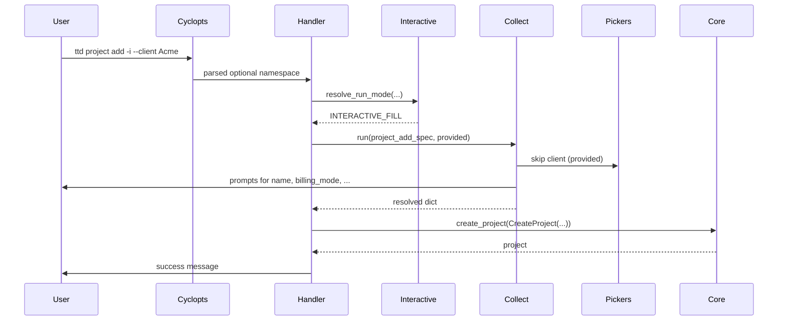

# feat: CLI interactive capture

## Summary

Add a **CLI interactive layer** in `ttd.cli`: bare mutating commands run guided prompts; `-i` fills missing fields when combined with partial flags; reference-existing inputs use **DB-backed pickers**; create-new inputs stay text. Implement shared **field specs** (reusable by M5 TUI later), wire all mutating commands (`client` / `project` / `log` / `entries`), and preserve today’s fully-flagged non-interactive path for scripts and CI. Use **questionary** for arrow-key selects; keep domain logic in `ttd.core` unchanged.

---

## Problem Frame

M2 delivered flag-only CLI. Parse-time required positionals block empty invocations (`ttd client add` errors before any handler runs). Delete/update expect UUIDs on the command line. This plan implements the interactive capture requirements (origin R1–R23) without changing billing rules in core.

---

## Requirements

Trace to origin **R1–R23**, flows **F1–F5**, acceptance **AE1–AE9**.

**Origin actors:** A1 (solo developer / CLI user), A2 (downstream implementer for TUI/API)

**Origin flows:** F1 (client add, no flags), F2 (project add + client picker), F3 (client delete + confirm), F4 (log interactive), F5 (scripted add, no prompts)

**Origin acceptance examples:** AE1–AE9 (see implementation unit test scenarios)

---

## Scope Boundaries

- Textual `ttd-tui` screens and widgets (M5) — field specs only, no TUI implementation
- stdin-piped prompt scripting (non-TTY must fail, not read lines)
- Interactive defaults on `list` / `health` / read-only commands
- New domain validation or delete policy changes in `ttd.core`
- Auto-interactive when partial flags are passed without `-i`
- API / Raycast / MCP surfaces

### Deferred to Follow-Up Work

- Extract shared field specs into a surface-neutral package for TUI binding (after M5 design exists)
- Fuzzy search / typeahead on long client lists (picker shows full list v1)
- `docs/solutions/` compound doc for cyclopts + questionary patterns (post-ship via `/ce-compound`)

---

## Context & Research

### Relevant Code and Patterns

- `src/ttd/cli/main.py` — root `App`, mounts command modules
- `src/ttd/cli/client_cmds.py`, `project_cmds.py`, `log_cmds.py`, `entries_cmds.py` — mutating handlers to extend
- `src/ttd/cli/runtime.py` — `ensure_db`, `parse_*`, `resolve_client`, `resolve_project`
- `src/ttd/cli/errors.py` — `cli_exit` (exit 1 not found, 2 validation)
- `src/ttd/cli/console.py`, `output.py` — Rich output; `_short_id` for labels
- `tests/cli/test_commands.py` — `run_cli(argv)` + `cli_db` fixture pattern
- `brainstorms/2026-05-26-cli-interactive-capture-requirements.md` — product source of truth

### Institutional Learnings

- No `docs/solutions/` entries yet for CLI interactive patterns.

### External References

- [questionary](https://questionary.readthedocs.io/) — `select`, `text`, `confirm` for CLI pickers
- [cyclopts](https://cyclopts.readthedocs.io/) — async commands, `Parameter`, optional arguments

---

## Key Technical Decisions

- **questionary as a direct runtime dependency** in `pyproject.toml` for select/confirm; invoke sync prompts via `asyncio.to_thread` from async handlers (see origin: picker library deferred to planning).
- **Handler-first interactive gate:** Mutating handlers take **optional** parameters (`None` = unset). At entry, `interactive.resolve_run_mode(...)` decides: interactive collect, non-interactive run, or `ValidationError` listing missing fields. Avoids fighting cyclopts with required positionals (origin cyclopts OQ resolved).
- **`-i` on every mutating handler** via shared `Annotated[bool, Parameter(name=["-i", "--interactive"])]` alias in a small `ttd.cli.parameters` module (or repeated per handler if cyclopts App-level flags prove awkward).
- **Empty invocation = interactive (R2):** After cyclopts parse, treat as interactive when **no user-supplied tokens** remain for that command besides the subcommand name (e.g. argv is exactly `["client", "add"]`). Do not rely on “all parameters are `None`” alone—defaults must not suppress interactive mode. Pass raw argv slice into `resolve_run_mode` from each handler (or a thin wrapper).
- **Field specs in `ttd.cli.collect`:** Declarative per-command sequences (`FieldKind.TEXT | SELECT | CONFIRM | CHOICE`) with labels, validators, and async `load_options` for pickers. Handlers call `collect.run(spec, provided=namespace)` → dict of resolved values. TUI can read the same specs later (R23).
- **Pickers in `ttd.cli.pickers`:** Thin wrappers: `pick_client()`, `pick_project(client_id)`, `pick_entry(...)`, `confirm_delete(label)` — load from core services, format `"Name (id prefix)"`, return entity or UUID.
- **Update interactive UX (origin OQ resolved):** **Pick target entity first**, then a **“which fields to change?”** multi-select (questionary `checkbox`), then prompt only selected optional fields. Skip fields not chosen. Non-interactive `update` unchanged (flags only).
- **Log interactive:** Reuse `log` flag validation: branch on duration vs interval after `CHOICE`; never mix `--hours` and interval in one collected session (AE9).
- **Cancel:** Catch `KeyboardInterrupt` at collect boundary → `error(...)` + `sys.exit(130)` or dedicated exit code documented in `errors.py` (R18).
- **Non-interactive regression:** Existing `tests/cli/test_commands.py` cases must pass unchanged; new `tests/cli/test_interactive.py` mocks collect/pickers.

---

## Open Questions

### Resolved During Planning

- Picker library: **questionary** (not Rich-only, not Textual).
- cyclopts: **optional params + handler gate** (not a custom App middleware v1).
- `update` interactive: **target pick + field checkbox + prompts**.

### Deferred to Implementation

- Whether cyclopts exposes “which options were explicitly passed” for distinguishing “flag omitted” vs “flag set to default”; if not, infer from `interactive` + all-`None` check only.
- Exact duplicate-name disambiguation in pickers when two clients share a name (surface core `ValidationError` as today).
- README vs `docs/getting-started.md` help examples (minimal mention in plan U6).

---

## Output Structure

```text
src/ttd/cli/
  parameters.py          # NEW — shared -i flag alias
  interactive.py         # NEW — run mode, TTY guard, empty/partial logic
  collect.py             # NEW — field specs + run loop
  pickers.py             # NEW — DB-backed selects + confirm
  client_cmds.py         # MODIFY
  project_cmds.py        # MODIFY
  log_cmds.py            # MODIFY
  entries_cmds.py        # MODIFY
  errors.py              # MODIFY (optional cancel exit)

tests/cli/
  test_interactive.py    # NEW
  test_commands.py       # MODIFY (only if argv shape changes for compat)

pyproject.toml           # MODIFY — questionary dependency
docs/roadmap.md          # MODIFY — note M2 interactive enhancement (U6)
```

---

## High-Level Technical Design

> *Directional guidance for review, not implementation specification.*



**Run-mode matrix (handler entry):**

| TTY | Args | `-i` | Required complete | Action |
|-----|------|------|-------------------|--------|
| no | any | yes | — | Fail: interactive requires terminal |
| yes | none | no | — | Interactive (R2) |
| yes | any | yes | — | Interactive fill missing (R3) |
| yes | some | no | no | Error: list missing (R4) |
| yes | any | no | yes | Run immediately (R6, F5) |
| yes | any | yes | yes | Run immediately (R6) |

---

## Implementation Units

- U1. **Interactive infrastructure and dependencies**

**Goal:** Shared run-mode detection, TTY guard, questionary wiring, and cancel handling.

**Requirements:** R1, R2, R4, R5, R6, R18, R21, R22

**Dependencies:** None

**Files:**
- Create: `src/ttd/cli/parameters.py`, `src/ttd/cli/interactive.py`
- Modify: `pyproject.toml`, `src/ttd/cli/errors.py` (if needed for cancel exit)

**Approach:**
- Add `questionary` to `[project] dependencies`.
- `interactive.py`: `RunMode` enum (`INTERACTIVE`, `RUN`, `ERROR`); `resolve_run_mode(*, interactive_flag, is_tty, provided: Mapping, required: Sequence[str])`; `require_tty()`.
- `parameters.py`: `InteractiveOpt = Annotated[bool, Parameter(name=["-i", "--interactive"], help="...")]`.
- Map `KeyboardInterrupt` to non-zero exit with short message.

**Patterns to follow:**
- `src/ttd/cli/errors.py` — exit code conventions

**Test scenarios:**
- Covers AE5. Edge case: non-TTY + interactive flag → fail with message that interactive mode requires a terminal
- Happy path: all required keys present, no interactive → RUN
- Covers R2. Edge case: argv `["client", "add"]` only → INTERACTIVE (not blocked by parameter defaults)
- Covers AE2 / R4. Error path: partial provided, no `-i` → ERROR with missing field names

**Verification:**
- Unit-test `resolve_run_mode` without DB or questionary UI

---

- U2. **Field specs, collect loop, and pickers**

**Goal:** Reusable collect/picker layer backing all commands.

**Requirements:** R7–R12, R19, R23

**Dependencies:** U1

**Files:**
- Create: `src/ttd/cli/collect.py`, `src/ttd/cli/pickers.py`
- Test: `tests/cli/test_interactive.py` (picker/collect unit tests with mocks)

**Approach:**
- `collect.py`: `FieldSpec` dataclass/Pydantic model (`name`, `kind`, `label`, `required`, `validator`, `choices`, `load_options` coroutine for selects); `async def run(specs, provided) -> dict`.
- `pickers.py`: async loaders calling `client_service.list_clients()`, `list_projects_for_client`, entry list helpers; format labels with name + `_short_id`; empty list → `ValidationError` with hint command.
- Run questionary calls in `asyncio.to_thread`.
- Validators delegate to `parse_decimal`, `parse_date`, etc.

**Patterns to follow:**
- `src/ttd/cli/runtime.py` — parsing and resolution
- `src/ttd/cli/output.py` — `_short_id`

**Test scenarios:**
- Covers AE4. Edge case: empty client list for project-add spec → ValidationError message mentions `client add`
- Happy path: mock `load_options` returns two clients; pick second returns correct UUID
- Edge case: dependent project list filtered by `client_id` in spec context

**Verification:**
- Collect unit tests pass with patched questionary returns

---

- U3. **Client commands — add, update, delete**

**Goal:** Interactive flows for all `ttd client` mutators.

**Requirements:** R13, R17; F1, F3; AE1, AE2, AE7, AE8 (R15 maps `entries update` in origin to CLI command name **`edit`** — see U5)

**Dependencies:** U1, U2

**Files:**
- Modify: `src/ttd/cli/client_cmds.py`
- Test: `tests/cli/test_interactive.py`

**Approach:**
- Refactor `add` / `update` / `delete` signatures to optional params + `InteractiveOpt`.
- `client add` spec: text name, rate, currency (default USD in spec).
- `client update` spec: pick client → checkbox fields to change → prompt selected.
- `client delete` spec: pick client → confirm.
- Handler body: resolve mode → collect or use flags → existing service calls unchanged.

**Patterns to follow:**
- Existing `CreateClient` / `UpdateClient` usage in `client_cmds.py`

**Test scenarios:**
- Covers AE1. Integration: patch collect to return valid add values; `run_cli(["client", "add"])` exits 0; client in DB
- Covers AE2. `run_cli(["client", "add", "--name", "Acme"])` exits 2; no client created
- Covers AE8. `run_cli(["client", "add", "--name", "Acme", "--rate", "150", "--currency", "USD"])` unchanged
- Covers AE7. Mock confirm false on delete → no delete; non-zero exit
- Happy path: interactive `client update` — pick client, select `name` field only, mock new name → `update_client` called

**Verification:**
- All `test_commands.py` client tests still pass

---

- U4. **Project commands — add, update, delete**

**Goal:** Interactive flows for `ttd project` mutators including billing-mode branching.

**Requirements:** R14, R10, R12; F2; AE3, AE4 (includes interactive `update` / `delete`)

**Dependencies:** U1, U2

**Files:**
- Modify: `src/ttd/cli/project_cmds.py`
- Test: `tests/cli/test_interactive.py`

**Approach:**
- `project add` spec: pick client → text name → choice billing_mode → conditional fields (rate/currency vs contract_total) mirroring handler branches today.
- `project update` / `delete`: same target-pick + checkbox / confirm pattern as client.

**Patterns to follow:**
- `_parse_billing_mode` in `project_cmds.py`

**Test scenarios:**
- Covers AE3. Partial `--client` + `-i`: collect skips client prompt; project under Acme
- Covers AE4. No clients: `project add` interactive fails with actionable error
- Happy path: hourly project add interactive with mocked picks
- Happy path: interactive `project update` — pick project, select one field, apply change

**Verification:**
- Existing project tests in `test_commands.py` pass

---

- U5. **Log and entries mutators**

**Goal:** Interactive `ttd log`, `ttd entries edit`, `ttd entries delete`.

**Requirements:** R15 (origin “entries update” = CLI **`entries edit`**), R12, R10; F4; AE6, AE9

**Dependencies:** U1, U2, U3–U4 (seed data patterns in tests)

**Files:**
- Modify: `src/ttd/cli/log_cmds.py`, `src/ttd/cli/entries_cmds.py`
- Test: `tests/cli/test_interactive.py`

**Approach:**
- `log` spec: pick client → pick project (filtered) → date (default today) → choice duration|interval → branch fields → optional note/billable.
- `entries edit`: pick entry (show project + date + hours in label) → checkbox fields → mode-aware prompts (reuse edit validation).
- `entries delete`: pick entry → confirm.

**Patterns to follow:**
- `log_cmds.py` duration vs interval mutual exclusion
- `entries_cmds.py` `edit` mode branching

**Test scenarios:**
- Covers AE6. Mock picks: log interactive only offers Acme’s projects
- Covers AE9. Duration branch creates duration entry; interval flags not combined
- Happy path: interactive log duration end-to-end with mocks
- Happy path: interactive `entries edit` — pick entry, select field, apply
- Covers AE7 (entries). Interactive `entries delete` with confirm declined → no delete

**Verification:**
- `test_project_and_log_duration` and entries tests in `test_commands.py` pass

---

- U6. **Help text, roadmap note, and docs polish**

**Goal:** Discoverability and milestone documentation.

**Requirements:** R16, R20

**Dependencies:** U3–U5

**Files:**
- Modify: command docstrings in `client_cmds.py`, `project_cmds.py`, `log_cmds.py`, `entries_cmds.py`
- Modify: `docs/roadmap.md` (M2 subsection: interactive capture enhancement)
- Modify: `README.md` (one example: `ttd client add` with no args) if README documents CLI usage

**Approach:**
- Docstrings mention: no args → guided prompts; `-i` for partial; flags for scripts.
- Roadmap: note shipped as M2 enhancement or “M2.1” without renumbering milestones — align wording with product owner preference.

**Test scenarios:**
- Test expectation: none — documentation-only unit (smoke: `--help` still exits 0)

**Verification:**
- `uv run ttd client add --help` mentions interactive behavior

---

## System-Wide Impact

- **Interaction graph:** Only `ttd.cli` mutating entry points change; `ttd.core.services` call graph unchanged.
- **Error propagation:** Collect/pickers raise or convert to same `ValidationError` / `NotFoundError` → `cli_exit`.
- **API surface parity:** No API changes; CLI argv contract extended (optional args) but full-flag invocations preserved.
- **Integration coverage:** `test_commands.py` proves non-interactive paths; `test_interactive.py` proves interactive paths with mocks.
- **Unchanged invariants:** Core delete guards, rate inheritance, log duration/interval rules, list commands, `ttd-api`, `ttd-tui` entry points.

---

## Risks & Dependencies

| Risk | Mitigation |
|------|------------|
| cyclopts optional-arg ergonomics differ per command | Spike in U1 on one command; replicate pattern in U3–U5 |
| questionary blocking under async | Always `to_thread`; never call from ferro/async DB callbacks inside sync prompt |
| Test flakiness with real TTY | Mock questionary/collect at module boundary; no real terminal in CI |
| Duplicate client names break picker resolution | Show short id in label; on ambiguity raise same `ValidationError` as `resolve_client` |
| Scope creep into TUI | Field specs only; no Textual in this plan |

---

## Documentation / Operational Notes

- Update `docs/roadmap.md` M2 bullet to mention interactive capture (U6).
- After merge, consider `/ce-compound` for cyclopts optional-params + questionary testing patterns.

---

## Sources & References

- **Origin document:** `brainstorms/2026-05-26-cli-interactive-capture-requirements.md`
- **Strategy:** `STRATEGY.md` (Terminal-first capture track)
- Related code: `src/ttd/cli/`, `tests/cli/test_commands.py`
- Architecture: `AGENTS.md`, `.cursor/rules/ttd-architecture.mdc`
