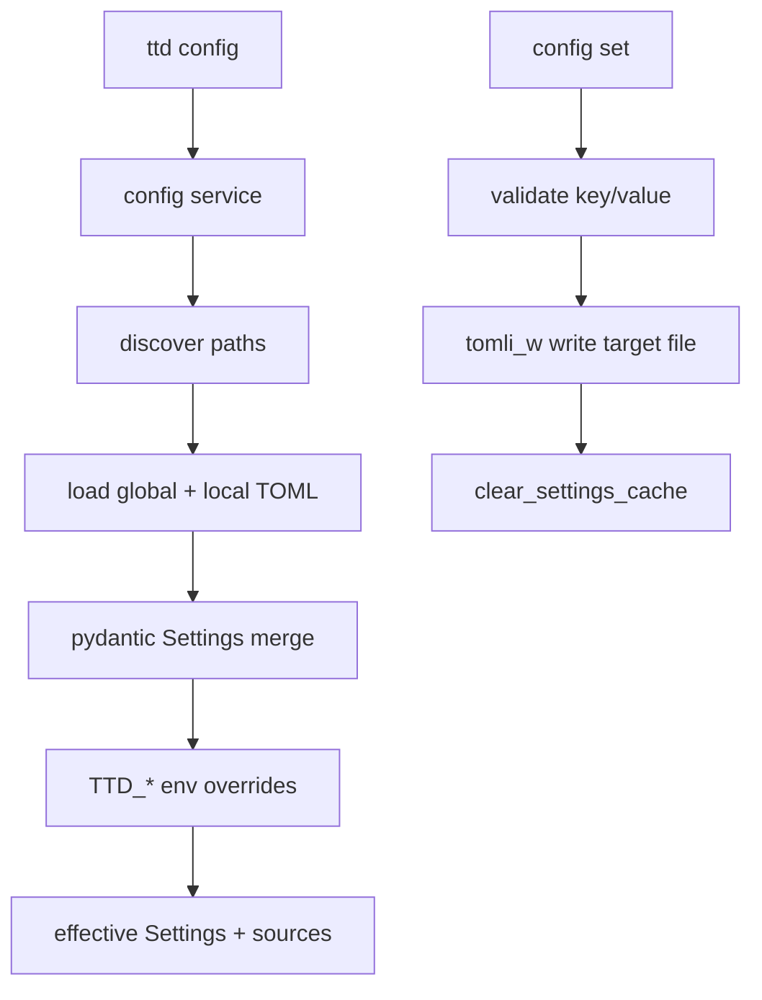

# feat: M4 configuration (TOML + CLI)

## Summary

Implement layered TOML configuration in `ttd.core` with global (`{XDG_CONFIG_HOME}/ttd/ttd.toml`) and local (nearest walk-up `ttd.toml`) files, pydantic-settings precedence (env → local → global → defaults), and a thin `ttd config show|get|set` CLI. v1 keys: `data_dir`, `db_filename`, `timezone`, `clock_format`. Display prefs are stored and editable now; log/list consumption remains a follow-up milestone (see `brainstorms/2026-05-26-config-setup-requirements.md`).

---

## Problem Frame

M3 export closes the period-close loop, but machine prefs still live only in env vars and cwd `.env`. Solo developers need persistent, editable config (including per-repo overrides) without hand-editing TOML or exporting shell variables. Config must exist outside SQLite, survive `ttd db reset`, and feed the same `get_settings()` path used by `ttd db` and DB init.

Origin requirements define behavior, precedence, and CLI surface — this plan sequences core loading, file I/O, CLI, and docs without re-litigating product scope.

---

## Requirements

Requirements trace to origin R1–R16. This plan satisfies them via implementation units U1–U6.

**Origin actors:** A1 (solo developer), A2 (implementer)

**Origin flows:** F1 (inspect config), F2 (local override), F3 (global default)

**Origin acceptance examples:** AE1–AE5

---

## Scope Boundaries

- Timezone/pendulum consumption, flexible `5pm` parsing, `config init` wizard — follow-up (`brainstorms/2026-05-26-config-setup-requirements.md`)
- API/TUI config editors
- Keys beyond v1 (`data_dir`, `db_filename`, `timezone`, `clock_format`)
- Comment-preserving TOML edits
- Git-root stop for local discovery (filesystem root for v1)

### Deferred to Follow-Up Work

- **Timezone follow-up milestone** — wire `timezone` + `clock_format` into `ttd.core.time`, log/list display, pendulum
- **`config init` interactive wizard** — optional later; `config set` is sufficient for M4
- **Git-root boundary for walk-up** — stop at repo root instead of `/` if dogfooding shows noise
- **`/ce-compound`** — capture non-obvious config pitfalls after ship (e.g. cwd-sensitive local discovery)

---

## Context & Research

### Relevant Code and Patterns

- `src/ttd/core/config.py` — `Settings`, `get_settings()`, `default_data_dir()`; extend here + small helper module
- `src/ttd/core/db.py`, `src/ttd/core/db_admin.py` — already call `get_settings()` / accept injected `Settings`
- `src/ttd/cli/db_cmds.py` — Rich table output pattern for `config show`
- `src/ttd/cli/export_cmds.py`, `src/ttd/cli/main.py` — cyclopts app registration pattern
- `tests/conftest.py` — isolated `Settings(data_dir=tmp_path)`; tests monkeypatch `get_settings`
- `docs/design/data-layer.md` — document config paths and precedence
- `brainstorms/2026-05-29-config-toml-requirements.md` — authoritative WHAT

### Institutional Learnings

- No `docs/solutions/` entries for config yet.

### External References

- pydantic-settings 2.14.x — custom `PydanticBaseSettingsSource` for file layers; env via built-in source
- stdlib `tomllib` (read), `zoneinfo.ZoneInfo` (timezone validation)

---

## Key Technical Decisions

- **Layered load in core, not CLI** — discovery, merge, validation, and source attribution live in `ttd.core.config` (and a small `config_files.py` helper if `config.py` grows). CLI only parses args and formats output.
- **Precedence:** `TTD_*` env → nearest local `ttd.toml` → global `ttd.toml` → defaults. Implement via pydantic-settings `settings_customise_sources` with ordered sources (first = highest priority per pydantic-settings v2).
- **Local discovery:** walk from `Path.cwd()` toward filesystem root; first existing `ttd.toml` wins. No merge of multiple ancestor files.
- **Global path:** `Path(os.environ.get("XDG_CONFIG_HOME", Path.home() / ".config")) / "ttd" / "ttd.toml"`.
- **TOML write:** read with `tomllib`, update dict, write with **`tomli-w`** (add dependency). Full-file rewrite of the **target** file only; no comment preservation in M4.
- **`config set` target:** local file in cwd when none exists on walk-up; `--global` writes global file. Only the chosen file is read/modified/written — other layers untouched.
- **v1 keys on `Settings`:** `data_dir`, `db_filename`, `timezone: str`, `clock_format: Literal["12h", "24h"]` (or small `StrEnum` in `models/enums.py`). Validate `timezone` with `ZoneInfo(name)` at validation time.
- **`get_settings()` caching:** `@functools.lru_cache` on `get_settings()` for process lifetime; expose `clear_settings_cache()` for tests. Document that CLI users need a new invocation after `config set`.
- **`config show` columns:** `key`, `effective`, `source` (`env` | `local` | `global` | `default`). Footer rows for global path, local path (or “none”).
- **No consumption of display prefs in M4** — log/list/export unchanged; keys round-trip via TOML only.
- **Dependency:** `tomli-w` via `uv add tomli-w` for writes.

---

## Open Questions

### Resolved During Planning

- **TOML write strategy:** Full rewrite of target file via `tomllib` + `tomli_w`; no `tomlkit`.
- **`show` UX:** Per-key `source` column plus path footers.
- **Walk-up boundary:** Filesystem root for v1.

### Deferred to Implementation

- Exact Rich styling for `config show` (match `ttd db where` table style)
- Whether `data_dir` paths in TOML are stored resolved or as-written (recommend expanduser/resolve on load)

---

## High-Level Technical Design

> *Directional guidance for review, not implementation specification.*



**Precedence (highest first):** env → local TOML → global TOML → defaults.

---

## Output Structure

```text
src/ttd/core/
  config.py              # MODIFY — Settings fields, get_settings, sources
  config_files.py        # CREATE — paths, discovery, read/write TOML
src/ttd/cli/
  config_cmds.py         # CREATE — show, get, set
  main.py                # MODIFY — register config app
tests/core/
  test_config.py         # CREATE
tests/cli/
  test_config_cmds.py    # CREATE
```

---

## Implementation Units

### U1. Config paths and local discovery

**Goal:** Resolve global and local config file paths; find nearest local `ttd.toml`.

**Requirements:** R1, R2

**Dependencies:** none

**Files:**
- Create: `src/ttd/core/config_files.py`
- Test: `tests/core/test_config.py`

**Approach:**
- `global_config_path() -> Path`
- `find_local_config(start: Path | None = None) -> Path | None` — walk cwd → root
- `local_config_write_path() -> Path` — nearest existing local file, else `cwd / "ttd.toml"`

**Test scenarios:**
- Happy path: local file in cwd is found.
- Happy path: local file in parent directory found when cwd is child.
- Edge case: no local file → `find_local_config()` returns `None`; write path is cwd/`ttd.toml`.
- Edge case: global path respects `XDG_CONFIG_HOME` when set.

**Verification:**
- Path helpers tested without filesystem side effects beyond `tmp_path`.

---

### U2. TOML read/write and layered dict merge

**Goal:** Load TOML layers and persist updates to a target file.

**Requirements:** R1, R4, R12, R13

**Dependencies:** U1

**Files:**
- Modify: `src/ttd/core/config_files.py`
- Test: `tests/core/test_config.py`

**Approach:**
- `read_toml(path: Path) -> dict[str, object]` — empty dict if missing
- `write_toml(path: Path, data: dict[str, object]) -> None` — mkdir parents, `tomli_w.dump`
- `load_merged_toml() -> tuple[dict, Path | None, Path]` — global dict, local dict, return paths for attribution
- `update_config_file(path: Path, key: str, value: object) -> None` — read, set key, write

**Test scenarios:**
- Happy path: write then read round-trips keys.
- Edge case: update creates file and parent dirs when missing.
- Edge case: update preserves unrelated keys in the same file.

**Verification:**
- File I/O tests use `tmp_path` only.

---

### U3. Settings model, sources, and source attribution

**Goal:** Extend `Settings` with v1 keys; implement precedence; expose effective values and per-key source.

**Requirements:** R3–R9, R14, R15

**Dependencies:** U2

**Files:**
- Modify: `src/ttd/core/config.py`
- Modify: `src/ttd/core/config_files.py` (if sources live there)
- Test: `tests/core/test_config.py`

**Approach:**
- Add fields: `timezone: str = "UTC"`, `clock_format: Literal["12h", "24h"] = "24h"` (defaults per origin).
- `@field_validator("timezone")` using `ZoneInfo`.
- Custom settings sources for local/global TOML dicts; env source first in customise chain.
- `get_settings()` with `@lru_cache`; `clear_settings_cache()`.
- `SettingSource = Literal["env", "local", "global", "default"]`
- `resolve_sources() -> dict[str, SettingSource]` — compare env presence, local vs global dict keys, else default.
- `CONFIG_KEYS` tuple listing v1 keys for show/get/set allowlist.

**Patterns to follow:**
- `src/ttd/core/config.py` existing `Settings` / `db_path` properties
- Validation errors → `ttd.core.exceptions.ValidationError` at CLI boundary

**Test scenarios:**
- Covers AE3. Env overrides local and global for same key.
- Covers AE2. Local overrides global when env unset.
- Edge case: missing files → defaults (`data_dir`, `db_filename`, `timezone`, `clock_format`).
- Edge case: invalid timezone rejected at Settings construction.
- Edge case: invalid `clock_format` rejected.
- Integration: `describe_db(get_settings())` uses TOML-backed `data_dir`.

**Verification:**
- Core config tests pass without CLI.

---

### U4. Config mutation API (`set` / `get` effective value)

**Goal:** Core helpers to update a key in local or global file with validation.

**Requirements:** R8, R12, R13, R14

**Dependencies:** U3

**Files:**
- Modify: `src/ttd/core/config.py` or `src/ttd/core/config_files.py`
- Test: `tests/core/test_config.py`

**Approach:**
- `set_config_value(key: str, value: str, *, global_: bool = False) -> Path` — parse/coerce value into typed field (reuse Settings validators), update target file, `clear_settings_cache()`, return written path.
- `get_config_value(key: str) -> str` — effective value as display string for CLI.
- Unknown key → `ValidationError`.

**Test scenarios:**
- Covers AE1. Global set creates file and persists `data_dir`.
- Covers AE5. `timezone` and `clock_format` round-trip through set + get.
- Error path: unknown key raises.
- Error path: invalid timezone raises.

**Verification:**
- Mutation tests use isolated temp config dirs (monkeypatch global path + local cwd via `tmp_path.chdir` or explicit paths).

---

### U5. `ttd config` CLI

**Goal:** Thin CLI: `show`, `get`, `set` with `--global`.

**Requirements:** R10–R14, F1–F3

**Dependencies:** U4

**Files:**
- Create: `src/ttd/cli/config_cmds.py`
- Modify: `src/ttd/cli/main.py`
- Test: `tests/cli/test_config_cmds.py`

**Approach:**
- `ttd config show` — Rich table: key, effective, source; muted footers for file paths.
- `ttd config get <key>` — plain stdout, no Rich (scriptable).
- `ttd config set <key> <value> [--global]` — call core setter, success message with path.
- Register `app.command(config_cmds.app)` in `main.py`.
- All errors via `cli_exit`.

**Patterns to follow:**
- `src/ttd/cli/db_cmds.py` — table layout
- `src/ttd/cli/export_cmds.py` — cyclopts App structure

**Test scenarios:**
- Covers AE4. CLI `show` after global + local files lists sources/paths.
- Covers AE1. CLI global set + get.
- Happy path: local set in tmp cwd creates `./ttd.toml`.
- Happy path: `get` stdout is single line, no ANSI.

**Verification:**
- CLI tests pass; `uv run ttd config --help` lists subcommands.

---

### U6. Documentation and dependency

**Goal:** Document config conventions; add `tomli-w`; note in README.

**Requirements:** R5, R16; success criteria (roadmap already updated)

**Dependencies:** U1–U5

**Files:**
- Modify: `docs/design/data-layer.md` — config section (paths, precedence, keys, CLI)
- Modify: `README.md` — brief `ttd config` mention under development or new config subsection
- Modify: `pyproject.toml`, `uv.lock` — `tomli-w`

**Approach:**
- data-layer: replace env-only note with layered TOML + env precedence; keep test isolation note (`Settings(data_dir=tmp_path)` unchanged).
- README: one example `ttd config show` / `ttd config set data_dir ...`.

**Test scenarios:**
- Test expectation: none — documentation only.

**Verification:**
- `just check` green after full implementation.

---

## System-Wide Impact

- **Interaction graph:** All commands that call `ensure_db()` → `init_db(get_settings())` automatically pick up TOML paths. Tests continue monkeypatching `get_settings` — no change required unless testing config itself.
- **Error propagation:** Invalid TOML on disk → Settings construction error with path in message; CLI maps via `cli_exit`.
- **State lifecycle:** `config set` does not call `close_db()` / reconnect automatically — user runs next command in fresh process; document that changing `data_dir` mid-session may require manual `ttd db migrate` in new location (hint in success message optional).
- **API/TUI:** unchanged in M4.
- **Unchanged:** Time parsing in `ttd.core.time` and export pipeline.

---

## Risks & Mitigations

| Risk | Mitigation |
|------|------------|
| cwd-sensitive local config surprises users | Document walk-up behavior; `config show` displays active local path |
| Invalid TOML breaks all commands | Catch parse errors with clear path; validate on load |
| `get_settings` cache stale after set | `clear_settings_cache()` on set; doc note for external file edits |
| Windows XDG paths | Use `XDG_CONFIG_HOME` fallback pattern already standard |
| Changing `data_dir` points at empty DB | `ttd db where` + optional hint to run `ttd db migrate` |

---

## Documentation / Operational Notes

- Existing dogfood DB at old path remains valid until user changes `data_dir` in config.
- Env vars remain escape hatch for CI and one-off overrides.

---

## Sources & References

- **Origin:** [brainstorms/2026-05-29-config-toml-requirements.md](../brainstorms/2026-05-29-config-toml-requirements.md)
- **Follow-up timezone behavior:** [brainstorms/2026-05-26-config-setup-requirements.md](../brainstorms/2026-05-26-config-setup-requirements.md)
- **Roadmap M4:** [docs/roadmap.md](../docs/roadmap.md)
