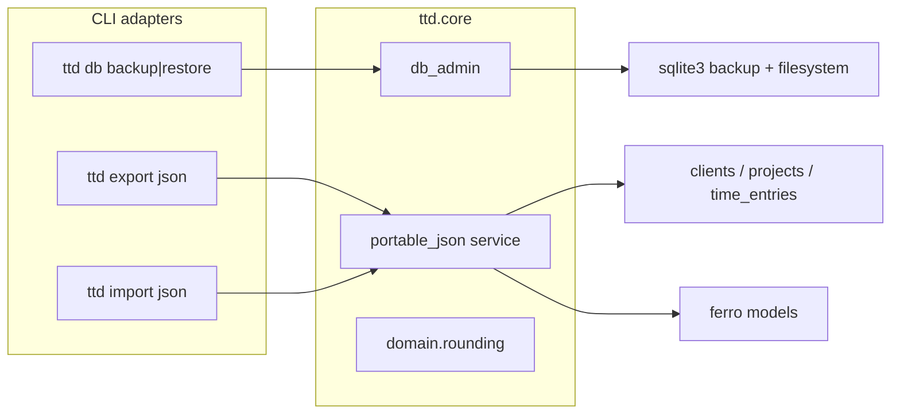
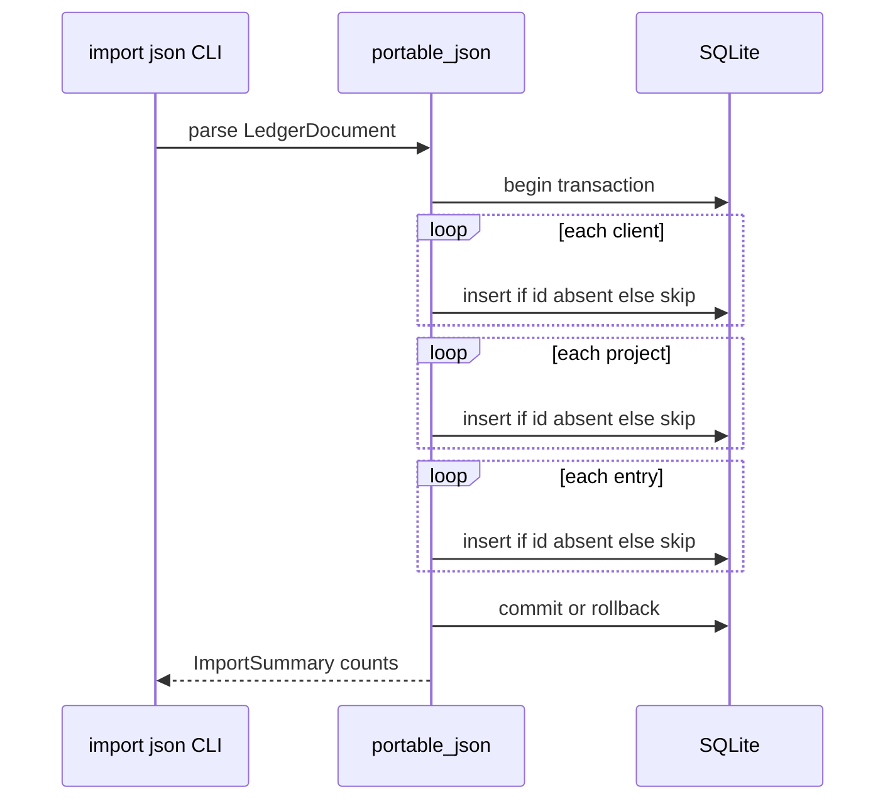

# feat: M5 data trust and hardening

## Summary

Implement M5 trust features in core first, then thin CLI: **`ttd db backup` / `ttd db restore`** using SQLite’s online backup API after `close_db()`; **`ttd export json`** / **`ttd import json`** with a versioned full-ledger document and skip-by-ID merge import; **Hypothesis** property tests for rounding; and **`fail_under = 68`** on the whole `ttd` package with new CLI/service tests so the gate is stable. Post-export edit audit remains out of scope (see origin).

---

## Problem Frame

M1–M4 shipped ledger capture, period export, and config, but there is no supported durability or portability story beyond manual SQLite file handling, rounding lacks property-test coverage, and pytest reports coverage without enforcing a floor. M5 closes those gaps before TUI and invoice surfaces multiply adapter code.

Origin requirements define behavior, merge policy, and success criteria — this plan sequences core services, CLI wiring, tests, docs, and the coverage gate without re-litigating product scope.

---

## Requirements

This plan satisfies origin R1–R18 via units U1–U6.

**Origin actors:** A1 (solo developer), A2 (maintainer)

**Origin flows:** F1 (backup), F2 (restore), F3 (JSON export), F4 (merge JSON import)

**Origin acceptance examples:** AE1–AE6

| ID | Requirement | Units |
|----|-------------|-------|
| R1–R6 | Backup/restore CLI + docs | U1, U4, U6 |
| R7–R9 | Full-ledger JSON export | U2, U4, U6 |
| R10–R14 | Merge JSON import (skip-by-ID) | U3, U4, U6 |
| R15–R16 | Hypothesis rounding + preserve hours tests | U5 |
| R17–R18 | Whole-package `fail_under` | U6 |

---

## Scope Boundaries

Carried from origin (unchanged):

- Post-export edit visibility, export snapshots, entry audit timestamps, change logs
- Destructive JSON import (replace ledger) — use SQLite restore instead
- CSV or other portable formats
- JSON import that updates existing records by ID
- Cloud sync, encryption at rest, multi-machine conflict resolution
- TUI/API routes for backup or JSON import in M5
- PDF/Markdown invoices, TUI product screens, Litestar API routes (M6–M8)
- Consuming `timezone` / `clock_format` in log/list (M4 follow-up)

### Deferred to Follow-Up Work

- **Roadmap doc sync** — update `docs/roadmap.md` M5 bullets to match shipped scope (remove edit-visibility ship criterion; note whole-package coverage)
- **`/ce-compound`** — document WAL/backup pitfalls and JSON merge edge cases after ship
- **JSON import update-by-ID** — future milestone when timestamps exist
- **Coverage ratchet** — raise `fail_under` above 68% once CLI interactive modules gain tests (M6+)

---

## Context & Research

### Relevant Code and Patterns

- `src/ttd/core/db_admin.py` — `describe_db`, `reset_database` (`close_db` + file delete + `init_db`); extend with backup/restore
- `src/ttd/core/db.py` — `close_db()`, `init_db()`, `reset_engine()` for cold-load tests
- `src/ttd/cli/db_cmds.py` — `--yes` confirmation pattern for destructive ops
- `src/ttd/core/services/export.py` — load/transform/serialize split; `enum_value()` at boundaries
- `src/ttd/cli/export_cmds.py` — `ensure_db`, `cli_exit`, `--output` path handling
- `src/ttd/cli/main.py` — cyclopts app registration
- `src/ttd/core/services/{clients,projects,time_entries}.py` — CRUD; import needs explicit-ID insert paths
- `tests/conftest.py` — autouse `isolate_app_config`; mandatory for new CLI tests
- `tests/cli/test_db_commands.py`, `tests/cli/test_export_cmds.py` — `run_cli` + `cli_db` patterns
- `tests/core/test_hours_hypothesis.py`, `tests/core/test_domain_rounding.py` — Hypothesis / unit precedents
- `brainstorms/2026-05-31-m5-data-trust-requirements.md` — authoritative WHAT

### Institutional Learnings

- `docs/solutions/architecture-patterns/layered-toml-config-pytest-isolation.md` — autouse config isolation; never hit real global `ttd.toml` in tests

### External References

- Python stdlib `sqlite3.Connection.backup()` — online backup; consolidates WAL into destination file (satisfies R2 consistency intent without manual `-wal`/`-shm` copy)
- SQLite backup docs — destination must not exist or be empty; validate with `PRAGMA integrity_check` after restore optional in tests

---

## Key Technical Decisions

- **SQLite backup API, not raw file copy** — After `await close_db()`, use `sqlite3.connect(source).backup(dest)` to produce a single restorable file. Meets R2 crash-consistency intent; sidecar files at source are not copied separately. (see origin: deferred WAL question)
- **Restore is destructive file replace** — Mirror `reset_database`: require `confirmed=True` / CLI `--yes`; delete target `db_path` and any `{db_path}-wal` / `{db_path}-shm` before copying backup into place; `await init_db()` afterward so ferro reconnects cleanly.
- **Separate portable JSON service** — New `src/ttd/core/services/portable_json.py` (name may vary); do not overload period export in `export.py`. Period export stays date-filtered; portable export is full ledger.
- **Versioned document DTO** — Pydantic models in `src/ttd/core/schemas.py` (or co-located module): top-level `schema_version: int`, `exported_at: datetime`, `clients`, `projects`, `time_entries` arrays. Serialize enums as string values; decimals as strings in JSON to avoid float drift.
- **`export json` requires `--output`** — Full ledger JSON is not written to stdout (unlike CSV default). Missing `--output` raises `ValidationError` with clear message. Matches structured export ergonomics.
- **Import ordering and atomicity** — Single import transaction: insert clients → projects → entries. Skip any record whose `id` already exists (count skipped). Abort entire import on validation failure or FK violation; no partial ledger state.
- **Explicit-ID insert helpers** — Add core helpers (e.g. `insert_client_if_absent`, `insert_project_if_absent`, `insert_entry_if_absent`) that preserve exported UUIDs; do not change existing `create_*` uuid4 behavior used by CLI capture.
- **Import confirmation** — Require `--yes` when import would insert ≥1 record (same pattern as restore). Dry parse-only mode not required in M5.
- **Hypothesis scope** — New `tests/core/test_rounding_hypothesis.py` targeting `round_hours_up` and `effective_rounding_increment` monotonicity/boundary properties; keep `test_hours_hypothesis.py` unchanged.
- **Coverage gate** — `[tool.coverage.report] fail_under = 68` (current measured baseline). Add `# pragma: no cover` to `src/ttd/core/seed/__main__.py` entry guard only. New M5 modules must ship with tests so total does not drop below floor.
- **Docs placement** — Add “Backup and restore” subsection to `docs/getting-started.md`; extend `docs/design/data-layer.md` with backup semantics and JSON schema overview; brief pointer in `README.md`.

---

## Open Questions

### Resolved During Planning

- **WAL copy sequence:** Use `sqlite3.backup()` after `close_db()`; no manual sidecar copy.
- **`export json` default output:** Require `--output` path.
- **Import ordering:** Clients → projects → entries; transactional rollback on failure.
- **`fail_under` threshold:** 68% whole package; omit only seed `__main__` via pragma.
- **Docs location:** `docs/getting-started.md` + `docs/design/data-layer.md` + README cross-link.

### Deferred to Implementation

- Exact JSON field naming for datetime fields (`started_at` ISO-8601 UTC strings)
- Whether import uses ferro explicit transaction API or delete-on-failure manual cleanup
- Rich summary formatting for import skip/insert counts

---

## High-Level Technical Design

> *Directional guidance for review, not implementation specification.*

**Import merge flow (skip-by-ID):**

---

## Implementation Units

### U1. Database backup and restore (core)

**Goal:** Core functions to snapshot and replace the active ledger file safely.

**Requirements:** R1–R5

**Dependencies:** None

**Files:**
- Modify: `src/ttd/core/db_admin.py`
- Create: `tests/core/test_db_admin_backup.py`

**Approach:**
- Add `BackupResult` / reuse `DbLocation` + size metadata dataclass for return values.
- `backup_database(destination: Path, settings=None) -> ...`:
  - Resolve source via `describe_db`; if not `exists`, raise `ValidationError`.
  - `await close_db()`.
  - Ensure parent dirs for destination exist.
  - Use stdlib `sqlite3` backup from `db_path` to `destination`.
  - Return destination path and byte size.
- `restore_database(source: Path, settings=None, *, confirmed: bool) -> ...`:
  - If not `confirmed`, raise `ValidationError` (mirror reset).
  - Validate source opens as SQLite (`sqlite3.connect` + quick query).
  - `await close_db()`.
  - Remove `db_path` and wal/shm sidecars if present.
  - Copy or backup API from source into `db_path`.
  - `await init_db(settings)`.
  - Return `describe_db`.

**Patterns to follow:** `reset_database` confirmation and `close_db` ordering in `src/ttd/core/db_admin.py`.

**Test scenarios:**
- Covers AE1. Backup populated ledger → destination exists, opens as SQLite, row counts match (via services).
- Backup when `db_path` missing → `ValidationError`, no empty destination file.
- Restore without `confirmed` → `ValidationError`.
- Covers AE2. Restore with `confirmed` → clients/list reflects backup data.
- Restore with invalid file → `ValidationError` before overwrite.
- Restore replaces prior ledger (seed client gone after restore from empty backup).

**Verification:** All U1 tests pass; manual `backup`/`restore` round-trip preserves client count.

---

### U2. Portable JSON export (core)

**Goal:** Serialize full ledger to a versioned JSON document.

**Requirements:** R7–R9, R8

**Dependencies:** None (reads existing models)

**Files:**
- Create: `src/ttd/core/services/portable_json.py`
- Modify: `src/ttd/core/schemas.py` (ledger DTOs + `ImportSummary`)
- Create: `tests/core/test_portable_json_export.py`

**Approach:**
- Define `LedgerClientRecord`, `LedgerProjectRecord`, `LedgerEntryRecord`, `LedgerDocument` pydantic models with all billing fields from ferro models (`rounding_increment_minutes`, `billing_mode`, interval fields, etc.).
- `async def export_ledger_json() -> LedgerDocument`: walk `list_clients` → `list_projects_for_client` → `list_time_entries_for_project` (same nesting as seed/export loaders).
- `def render_ledger_json(document: LedgerDocument) -> str`: `model_dump_json` with stable key order if practical.
- Use `enum_value()` when reading enum fields from models for serialization.
- Read-only: no DB writes.

**Patterns to follow:** DTO separation like `ExportDetailRow` in `src/ttd/core/services/export.py`; list walks like `src/ttd/core/seed/runner.py`.

**Test scenarios:**
- Covers AE3. Two clients, five entries → JSON parses; all IDs present; project `client_id` links valid.
- Empty ledger → valid document with empty arrays and `schema_version`.
- Decimal fields serialize as strings (or documented format) without float rounding.
- Export does not mutate DB (entry count unchanged).

**Verification:** U2 tests pass; exported JSON validates against `LedgerDocument` round-trip.

---

### U3. Merge JSON import (core)

**Goal:** Import ledger records from JSON, skipping existing IDs.

**Requirements:** R10–R14, R11

**Dependencies:** U2 (shared `LedgerDocument` schema)

**Files:**
- Modify: `src/ttd/core/services/portable_json.py`
- Modify: `src/ttd/core/services/clients.py`, `projects.py`, `time_entries.py` (minimal insert-if-absent helpers)
- Create: `tests/core/test_portable_json_import.py`

**Approach:**
- `async def import_ledger_json(document: LedgerDocument, *, confirmed: bool) -> ImportSummary`:
  - If inserts needed and not `confirmed`, raise `ValidationError`.
  - Parse/validate FK references inside document before writes.
  - For each client: if `Client.get_or_none(id)` → skip else insert with explicit id.
  - For each project: skip if id exists; else verify `client_id` exists (in DB or inserted this run) before insert.
  - For each entry: skip if id exists; else verify `project_id` exists before insert.
  - Return counts: inserted/skipped per entity type.
- Reuse validation helpers from existing `create_*` (rounding minutes, billing mode rules) inside insert paths.
- On any failure mid-import, rollback (transaction or compensating deletes — pick one in implementation).

**Execution note:** Add characterization tests for skip-by-ID before expanding insert helpers.

**Test scenarios:**
- Covers AE4. Import into empty DB → all records inserted.
- Import same file twice → second run skips all; summary shows skipped counts only.
- Import entry referencing unknown `project_id` → fails with no new rows (transactional).
- Import with pre-existing client ID collision → client skipped; new projects/entries for other IDs still import if valid.
- Cold load after import: `reset_engine()` + reload entry; enum fields hydrate (ferro regression guard).

**Verification:** U3 tests pass; AE4 scenarios green.

---

### U4. CLI commands (backup, restore, export json, import json)

**Goal:** Thin adapters exposing U1–U3 via cyclopts.

**Requirements:** R1, R4, R7, R10, R14, R6 (docs in U6)

**Dependencies:** U1, U2, U3

**Files:**
- Modify: `src/ttd/cli/db_cmds.py`
- Modify: `src/ttd/cli/export_cmds.py`
- Create: `src/ttd/cli/import_cmds.py`
- Modify: `src/ttd/cli/main.py`

**Approach:**
- `db backup DESTINATION` positional path → `await db_admin.backup_database` → `success()` with path and size (reuse `_format_bytes`).
- `db restore SOURCE --yes` → `await db_admin.restore_database(confirmed=yes)`.
- `export json --output PATH` subcommand on export app → `ensure_db` → `export_ledger_json` → write file → `success()`.
- Top-level `import` app: `import json PATH --yes` → read file → parse `LedgerDocument` → `import_ledger_json`.
- All commands: `try/except BaseException: cli_exit(exc)`.

**Patterns to follow:** `src/ttd/cli/db_cmds.py` reset confirmation; `src/ttd/cli/export_cmds.py` output file write.

**Test scenarios:**
- `db backup` to tmp path → exit 0, file exists.
- `db restore` without `--yes` → exit 2.
- `export json` without `--output` → exit 2 with helpful message.
- Covers AE3/AE4 via CLI: export to tmp, reset db, import with `--yes`, `client list` shows imported client.
- `import json` without `--yes` when inserts required → exit 2.

**Verification:** CLI tests pass; commands registered in `ttd --help`.

---

### U5. Hypothesis property tests for rounding

**Goal:** Property-test export rounding invariants.

**Requirements:** R15, R16

**Dependencies:** None

**Files:**
- Create: `tests/core/test_rounding_hypothesis.py`

**Approach:**
- `@given` hours (non-negative Decimal strategy) and increment minutes (positive int or None).
- Assert `round_hours_up(hours, inc) >= hours`.
- When increment set, result is multiple of increment/60 in hours space.
- `@given` client/project rounding fields → `effective_rounding_increment` matches inheritance rules from `tests/core/test_domain_rounding.py`.

**Patterns to follow:** `tests/core/test_hours_hypothesis.py` strategies and assertion style.

**Test scenarios:**
- Covers AE5. Monotonicity and increment multiple properties across generated inputs.
- Regression: existing `test_domain_rounding.py` and `test_hours_hypothesis.py` remain green unchanged.

**Verification:** Hypothesis tests pass with default profile.

---

### U6. Coverage gate, gap tests, and documentation

**Goal:** Enforce whole-package coverage floor and document backup/restore.

**Requirements:** R6, R17, R18

**Dependencies:** U1–U4 (CLI tests contribute coverage)

**Files:**
- Modify: `pyproject.toml` (`fail_under = 68`)
- Modify: `src/ttd/core/seed/__main__.py` (pragma no cover on entry)
- Modify: `docs/getting-started.md`, `docs/design/data-layer.md`, `README.md`
- Modify: `docs/roadmap.md` (M5 status / scope alignment)
- Extend: `tests/cli/test_db_commands.py` if not fully covered in U4 file split

**Approach:**
- Add `fail_under = 68` under `[tool.coverage.report]`.
- Ensure new CLI/core tests from U1–U4 run under `uv run pytest` with cov; add minimal smoke tests if total would drop below 68 after new modules (unlikely if tests accompany features).
- Document backup/restore commands, destructive restore warning, JSON export/import merge semantics, skip-by-ID limitation.

**Test scenarios:**
- Covers AE6. Temporarily lower `fail_under` in a branch → pytest fails (manual verification during implementation); restore 68 before merge.
- CI/prek pytest job still passes with gate enabled.

**Verification:** `uv run pytest` exits 0 with coverage ≥ 68%; docs build if touched paths affect zensical (getting-started only — verify no warnings).

---

## System-Wide Impact

| Surface | Impact |
|---------|--------|
| **CLI** | New `db backup`, `db restore`, `export json`, `import json` commands |
| **Core** | `db_admin` backup/restore; new `portable_json` service; small service insert helpers |
| **API / TUI** | Unchanged (placeholders remain); coverage gate applies to their entrypoints |
| **CI** | pytest may fail if coverage drops below 68% |
| **Docs** | getting-started, data-layer, roadmap, README |

---

## Risks and Mitigation

| Risk | Mitigation |
|------|------------|
| Backup while another process holds DB lock | Document single-user local-first assumption; `close_db()` before backup; clear error on lock failure |
| JSON schema drift vs models | `schema_version` field; tests round-trip all model fields |
| Skip-only import confuses users re-syncing edits | Document in getting-started; deferred update-import milestone |
| `fail_under` blocks PRs on unrelated low-coverage modules | Lock at current 68%; ratchet later; new code must include tests |
| ferro cold-load enum strings after import | Import tests call `reset_engine()` and assert enum types |

---

## Verification Strategy

- Unit/core: U1, U2, U3, U5 test files
- CLI integration: U4 tests with `isolate_app_config` + `cli_db`
- Quality gate: `just check` + `uv run pytest` (with `fail_under`)
- Manual smoke: backup → edit → restore → verify; export json → import into fresh data dir

---

## Documentation Plan

- `docs/getting-started.md` — backup/restore workflow, JSON portability section
- `docs/design/data-layer.md` — backup API behavior, JSON schema version 1 fields
- `README.md` — one-line mention under usage
- `docs/roadmap.md` — mark M5 in progress/done when shipped; align scope bullets with brainstorm

---

## Suggested Implementation Order

1. U1 → U2 → U3 (core complete, independently testable)
2. U4 (CLI wiring)
3. U5 (parallel with U4 if desired)
4. U6 (enable gate last once tests land)

---

## Sources & References

- Origin: `brainstorms/2026-05-31-m5-data-trust-requirements.md`
- Strategy: `STRATEGY.md` (Data trust & portability track)
- Architecture: `AGENTS.md`, `docs/design/general.md`, `docs/design/data-layer.md`
- Prior plans: `plans/2026-05-29-001-feat-config-toml-plan.md`, `plans/2026-05-25-003-feat-export-period-close-plan.md`
